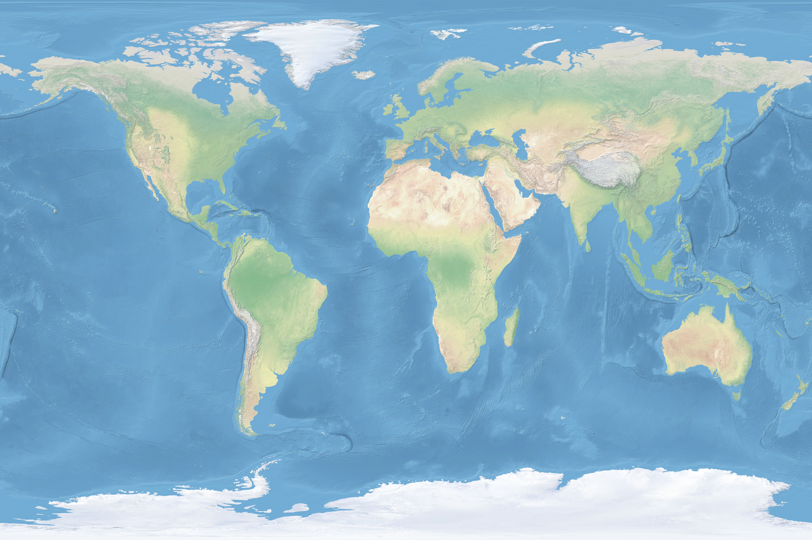

# Captain's Travel Log: Notable Cities and Settlements

**Captain Victoria Hawthorne**  
*H.M.A.S. Copper Phoenix*  
*Anno Domini 1887, Third Year of the Great Steam Revolution*

---

My dear colleagues and fellow aeronauts, these notes represent three years of careful observation and navigation across the known world. Each location herein has been personally visited aboard the *Copper Phoenix*, and I have endeavored to record not only the geographical coordinates essential for navigation, but also the character and peculiarities of each settlement that make them worthy of note.

The world map below shows the extent of our known territories, marked with the steam routes and aerial highways that connect our great civilization:

## Port Aetherton
**Coordinates:** 51°30'N, 0°05'W  
**Elevation:** 200 feet above sea level

The crown jewel of aerial commerce, Port Aetherton stands as a testament to the ingenuity of steam-powered civilization. Built upon the chalk cliffs of the southern coast, its massive docking towers reach skyward like the fingers of giants, each capable of mooring vessels of even the largest tonnage. The city's famous Crystal Aerodrome, constructed entirely of iron and glass in the latest architectural fashion, serves as both marketplace and marvel of engineering.

The inhabitants are a industrious sort, their lives governed by the great steam whistles that announce the arrival and departure of the aerial fleet. One can procure here the finest Welsh coal, precision-manufactured brass fittings, and tea of exceptional quality—though I must caution against the local ale, which tends toward the bitter side.

## New Britannia
**Coordinates:** 40°45'N, 73°58'W  
**Elevation:** 35 feet above sea level

Across the great western ocean lies this remarkable colonial outpost, where the architecture of the old world mingles with the boundless optimism of the new. The harbor bristles with steam-powered cranes that load cargo day and night, their mechanical arms never tiring in their eternal dance of commerce.

The city proper extends inland along broad avenues lit by gaslight, though I am told that experiments with electrical illumination show great promise. The local populace has adapted admirably to aerial commerce, with many establishing themselves as skilled riggers, weathermen, and steam engineers. Their vernacular, while recognizably English, has developed certain colorful expressions unknown in the homeland.

## Brass Harbor
**Coordinates:** 55°52'N, 4°15'W  
**Elevation:** 120 feet above sea level

Nestled in the highlands of the northern territories, Brass Harbor serves as the gateway to the coal fields that fuel our great enterprise. The settlement has grown organically around the great mining works, its buildings climbing the hillsides in terraced rows like some ancient amphitheater.

The local folk are hardy and practical, their hands permanently stained with the honest grime of industry. They have developed ingenious systems of pneumatic tubes that carry messages and small cargo between the mines and the aerial port with remarkable efficiency. The taverns here serve a warming beverage made from fermented grains and honey that provides excellent fortification against the highland winds.

## Copper Creek Station
**Coordinates:** 34°03'N, 118°15'W  
**Elevation:** 285 feet above sea level

This frontier settlement represents the furthest reach of reliable aerial service to the western territories. Built around natural hot springs that provide steam power for local industry, Copper Creek has become an essential refueling station for vessels venturing into the unmapped regions beyond.

The town maintains a distinctly makeshift character, with buildings constructed from whatever materials come to hand—salvaged airship hulls, desert stone, and timber floated down from the northern forests. Yet beneath this rough exterior lies a community of remarkable resilience and ingenuity, ever ready to assist travelers in distress.

## Victoria Falls Trading Post
**Coordinates:** 17°55'S, 25°52'E  
**Elevation:** 3,500 feet above sea level

Perhaps the most spectacular of all aerial ports, this station is built upon the very edge of the great cataract that gives it its name. The constant mist provides natural humidity for the steam engines, while the thunderous roar of falling water serves as a perpetual reminder of nature's awesome power.

The trading post serves as the central hub for commerce with the interior tribes, who have proven surprisingly adaptable to aerial transportation. They provide exotic goods—rare minerals, fine leathers, and medicinal herbs—in exchange for manufactured items from the industrial centers. The local cuisine, featuring game meats prepared with indigenous spices, offers a welcome change from shipboard rations.

## Dragon's Teeth Monastery
**Coordinates:** 27°59'N, 86°55'E  
**Elevation:** 12,000 feet above sea level

High in the world's greatest mountain range sits this extraordinary settlement, home to monks who have mastered the art of high-altitude living. Their monastery, carved directly into the living rock, provides a crucial waystation for vessels crossing the great peaks.

The monks have developed a sophisticated understanding of mountain weather patterns and provide invaluable meteorological services to passing aircraft. Their hospitality is legendary among aeronauts, offering not only shelter and hot meals, but also spiritual counsel for those whose souls have been troubled by the vastness of the sky.

---

*May these notes serve future navigators well, and may fair winds carry them safely to their destinations.*

*V. Hawthorne, Captain*  
*H.M.A.S. Copper Phoenix*
