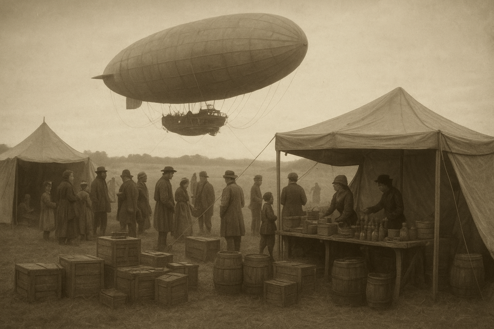

# The Fields of Evermere

By Captain Seraphine Drax, Aboard the Hallowthorn
Year of the Æthercurrents 128 (Alternative Calendar of the Brass League)

The *Hallowthorn* exhaled steam as she settled, her great gasbag creaking like the lungs of an old giant finally at rest. Ropes hissed down from the gondola, thick hemp braids biting into the grass of Evermere’s wide plain. The crew leapt to their work, boots sinking slightly in the loam.

“Mind the crates, lads, careful!” barked Bosun Ketteridge, his monocle fogged from the descent. His orders snapped like the rigging in high winds. The men—greased with soot, smelling of iron and tar—lowered down boxes stenciled in faded lettering: Lamps, Distilled Spirits, Copper Wares. Each crate groaned against their shoulders, wood rough and splintered, bound with tarnished brass straps.

Seraphine Drax stepped down last. Her boots pressed into earth with the faintest crunch. She drew in the scent of wild barley and peat smoke drifting from the low hills. For weeks they had drifted above clouds and smoke-belching cities, and now, for the first time, she felt the steady heartbeat of soil.

The locals had gathered already. They came from the hamlets dotting the field’s edge—broad-shouldered folk in woolen coats, with eyes that never seemed rushed. Children darted between them, bold enough to tug at the dangling ends of the airship’s ropes, then flee laughing. The eldest among them, a wiry woman with a scar that carved her cheek like a permanent smile, raised her hand in greeting.

“You’ve flown far,” she said. Her accent bent vowels like willow branches in the wind.

“Far enough,” Seraphine replied, lips quirking. “And lighter than when we came.”

That night the trading post grew from nothing but tents, canvas squares lit within by amber lanterns. Stakes driven deep into earth echoed like muffled hammer blows across the meadow. Crews from the Hallowthorn stacked their goods under oilcloth shelters, while the locals brought baskets woven with reeds, inside them the strange red root they chewed like tobacco. They called it tavarn root—sharp, peppery, warming like brandy when steeped in water.

They traded the tavarn root for copper kettles, for little glass bottles of lamp-oil, for ribbons dyed in strange hues the crew had brought from Far Anglor. A man with arms thick as ox-yokes insisted on swapping his carved bone whistles for a small barrel of rum. The whistles sounded like birdcalls, but eerily human in tone; when Bosun Ketteridge tried one, three owls swooped low, mistaking him for kin.

By day, laughter mingled with haggling. By night, smoke from cooking fires stitched the field to the stars. The crew lounged on upturned crates, sipping spirits, boots off, trading stories as sparks leapt into the darkness. They were wanderers by trade: Ketteridge with his obsession for mechanical puzzles, young Ada Spence sketching every new bird she saw into her journal, and Jory—forever rolling dice with the locals, forever losing, yet somehow richer each time.

Seraphine watched it all from the fire’s edge, her coat hung loose, eyes reflecting flame. For her, command meant not just steering skyward, but balancing the fragile line between order and freedom, between commerce and kinship. She let them laugh, let them sleep deep in canvas tents that smelled of smoke and damp wool. They needed it, for in the sky sleep never came gently.

The locals had quirks aplenty. They clapped not by striking palms but by stomping heel against earth. They believed their livestock would grow sick if you sang near them, but whistling was welcomed. They asked endless questions about the stars, for none among them had ever left the ground, and Seraphine caught herself wondering how it must feel to gaze up one’s whole life and never drift among those lights.

After a week the field was littered with memories: bootprints, ash circles, the faint perfume of tavarn root lingering in the air. The Hallowthorn’s ballast was lighter, her crew heavier with strange gifts—a cage of doves that cooed in triplets, embroidered sashes smelling faintly of heather, and a carved wooden idol of a fox, its grin sharper than the real creature’s.

Departure day came as quietly as dawn itself. Crates were hauled aboard, the steam-valves sighed awake, and the envelope of the Hallowthorn swelled with life once more. Seraphine shook hands with the scarred woman, whose palm was calloused yet warm.

“You’ve taken part of Evermere with you,” the woman said.

“And left some of the sky here,” Seraphine replied.

The ship rose, ropes coiling like snakes into the gondola. Below, the field shrank into a patch of green, tents like scattered petals soon swept into insignificance. The crew leaned from the rails, waving until their arms tired. Then they turned back to their duties, back to the rhythm of gears and gauges, back to the way of skyfolk: half merchants, half dreamers, always moving, always seeking the next horizon.

Above them, the clouds parted just enough to let the sun strike the brass fittings of the Hallowthorn. For a heartbeat, she looked less like a ship and more like a star caught halfway between heaven and earth.
