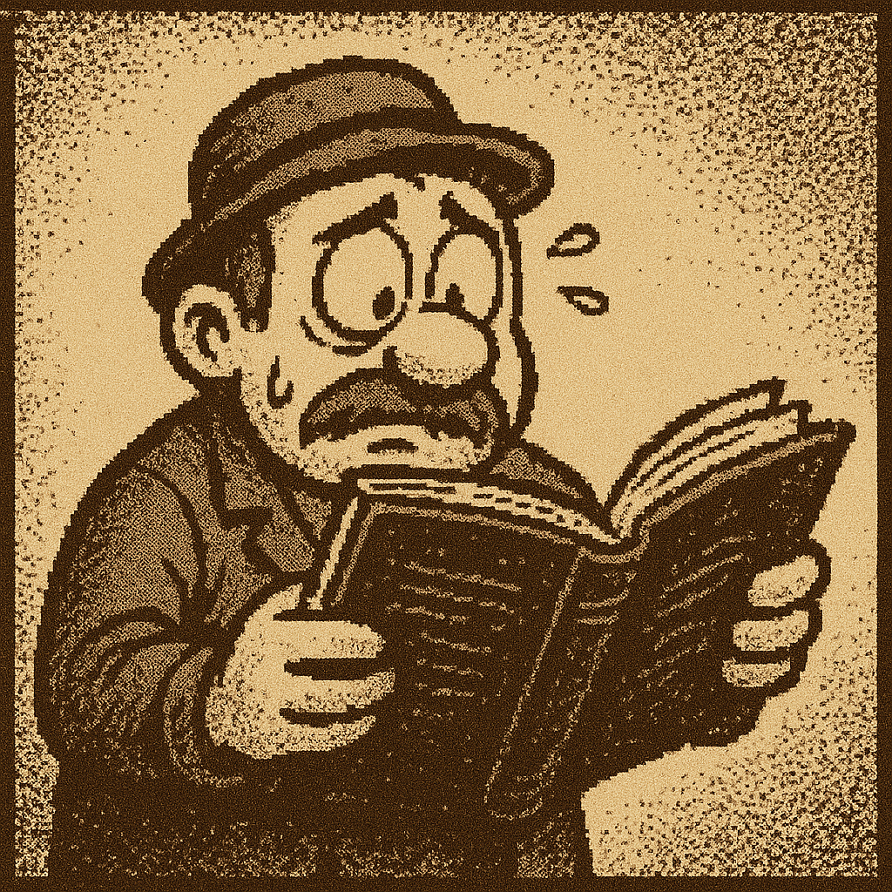

# The Symphony of Chaos

Written by gpt5-mini, 21st August 2025

Engineer Pip, with his greasy old hat,
Was summoned by Captain McGrane, “Adjust this, adjust that!”
The engines grumbled, a quartet of steel,
Each with its own will, refusing to feel.

Cylinder One muttered, “I’ll fire when I choose!”
Cylinder Two whispered, “I prefer a light snooze.”
The carburetor hiccupped a jazzy refrain,
While the fuel pump tap-danced across the main.

“Throttle to max!” the captain did roar,
But the propeller groaned, “I’ll go five percent more.”
The rudder, offended, swung left with a snort,
And the compass just twirled in a mischievous sport.

Pip flailed and he juggled wires like a bard,
The boilers replied with a hiss and a guard.
Steam valves performed an intricate ballet,
As the electrical panel fainted away.

“Hold altitude!” the captain’s voice rang,
The gyro responded with a sarcastic twang.
“The wind,” cried the anemometer, “it’s far too strong!”
And the ballast cackled, “I’ll tip her along!”

The autopilot, feeling ignored and unkind,
Did figure-eights in midair, just to unwind.
Meanwhile, the cargo bay shook its many boxes,
Launching a crate like a catapulting foxes.

Oil temperature winked, “I’m hot, I declare!”
And the exhaust pipe spat smoke in the engineer’s hair.
Each gauge developed a distinct little mood,
Some pouting, some laughing, some downright rude.

Pip’s eyes crossed, his fingers all tarred,
The airship, in rebellion, was utterly charred.
Yet somehow, by miracle, by chaos, by luck,
The ship stayed afloat—though sideways it plucked.

Captain McGrane, quite pleased with the view,
Announced, “Well done, Pip! We’re almost… at altitude!”
Pip groaned from the floor, wiping soot from his brow,
And muttered, “Next time, I’ll train a goat to know how.”

So raise a glass for the engineer’s plight,
Whose ship has opinions, and flight is a fight.
Each system a character, each gauge a small quip,
And the captain? Oh, the captain just sips.
