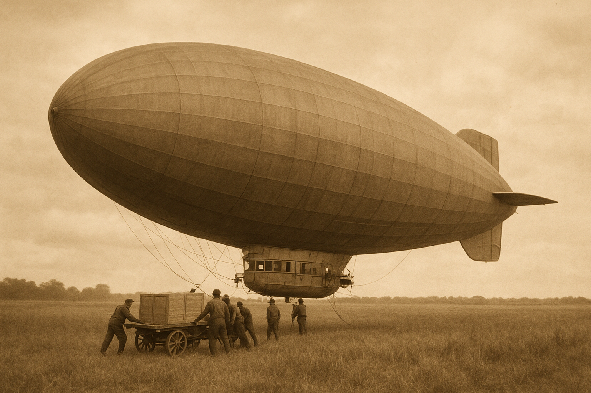

# Wind in the Wires
**Being a True and Faithful Account of the Intimate Communion Between an Airship Captain and His Beloved Vessel**

*From the Personal Journals of Captain Algernon Weatherby*  
*Master of the Royal Aeronautical Vessel "Celestial Endeavour"*  
*Anno Domini 1887*

---

## A Pilot's Reverie: The Song of Steam and Sky

*18th October, 1887*  
*Aloft at 1,250 feet, somewhere above the Yorkshire Dales*

How does one articulate the sublime communion betwixt a mariner of the aerial seas and his vessel? 'Tis a question that has vexed me these many months as I traverse the heavens aboard my stalwart companion, the *Celestial Endeavour*. For she is no mere conveyance of timber and canvas, no silent beast of burden—nay, she is a living creature of brass and steam, copper and cordage, who speaks to me in a thousand whispered tongues.

Even now, as I pen these words in my navigation journal, she serenades me with her eternal symphony. The rhythmic *thrum-thrum-thrum* of our six-cylinder radial engine pulses through the deck plates beneath my boots—sixty-five beats to the minute, steady as a lover's heart. Each cylinder fires in perfect sequence, a percussion ensemble of controlled explosions that drives our brass propeller through the crystalline air. I can hear the subtle variations: cylinder three runs ever so slightly rich this morning, betraying itself with that telltale deeper note on every sixth beat. The mixture wants adjusting ere we reach altitude proper.

But listen! Can you discern the soprano melody that dances above the engine's baritone? 'Tis the wind herself, singing through our rigging with voices both high and low. The stays and shrouds catch the breeze at a thousand different angles, each wire tuned to its own ethereal pitch. When she blows steady from the west, as she does this fine morning, the higher frequencies harmonise in a celestial chord that would make the angels weep. Yet when turbulence disturbs our passage—when the hull encounters those invisible rivers of disturbed air that cascade from hill and dale below—ah! then the music becomes a wild fugue of overlapping voices, each frequency interfering with its neighbours in patterns of mathematical beauty.

## The Ballad of Ballast and Balance

*Later that same morning, after taking on supplies at Harrogate Aerodrome*

There is no sensation quite so singular as feeling one's vessel respond to the careful redistribution of her vital humours. This morning we took aboard three crates of fuel drums — forty four gallons each — and two cases of medical supplies bound for the garrison at Edinburgh. Young Pemberton, my cargo master, directed their placement in the loading bay with all the precision of a conductor arranging his orchestra.

But mark how she spoke to me of this new burden! No sooner had we secured the fuel drums in the aft cargo hold than I felt her nose rise ever so slightly, the control yoke growing light beneath my gloved hands. The artificial horizon told the tale: our attitude had shifted two degrees nose-up, and our indicated airspeed had begun to bleed away. From eighty-five knots, we dropped to seventy-eight, then seventy-five. The engine note remained unchanged—still that reassuring sixty-five beats per minute—but the wind song had shifted. The high frequencies that speak of clean airflow had diminished, replaced by the fuller, more turbulent tones that herald a loss of aerodynamic efficiency.

"She grows heavy aft," I murmured to myself, though First Officer Carruthers heard and nodded his understanding. A gentleman of the old school, Carruthers, who comprehends that an airship captain must speak aloud his thoughts, for 'tis only in voicing them that one truly hears what the ship is saying.

The remedy lay in the fuel management chamber, that sanctum sanctorum where brass pipes and copper valves govern the very lifeblood of our vessel. Here, behind panels of polished mahogany and etched glass, dwell the controls that manage our two great fuel tanks—forward and aft, each capable of holding one hundred and eighty gallons of that precious refined petroleum that feeds our engine's hungry maw.

I could see at a glance that the additional cargo had upset our delicate equilibrium. The forward tank showed one hundred and forty gallons, whilst the aft tank held an equal measure. But with those fuel drums now secured abaft, our centre of gravity had shifted beyond the optimal range. The solution was as elegant as it was necessary: I must transfer fuel from the aft tank to the forward, counterbalancing the weight of our new cargo with the weight of our existing stores.

## The Hydraulic Ballet

*Still 18th October, approaching the Scottish border*

How satisfying is the operation of a properly designed fuel system! Each tank is blessed with its own transfer pump—magnificent brass affairs with leather-cupped pistons that move the liquid gold from one reservoir to another with the measured precision of a chronometer. The forward transfer pump moves fuel aft to forward, whilst the aft transfer pump performs the reverse operation.

I set the aft transfer control to thirty percent, watching the bronze needle swing across the calibrated dial. Immediately, I could hear the change in her voice—not merely the additional note of the pump itself, a steady *chunk-chunk-chunk* of machinery in motion, but the subtler alteration in the wind song as our trim began to correct itself. The higher frequencies returned as clean airflow reestablished itself about our hull. Our airspeed crept upward: seventy-eight knots, eighty, eighty-two.

Five minutes of pumping, and I reduced the transfer rate to fifteen percent. Ten minutes more, and I closed the valve entirely. The artificial horizon now showed level flight, our airspeed had stabilized at eighty-five knots, and the wind sang once more in perfect harmony. The *Celestial Endeavour* had found her proper attitude, balanced as delicately as a dancer en pointe.

But observe how she rewarded my attention! With her trim restored, the engine's burden lightened. The manifold pressure gauge showed a fractional increase—from twenty-four and one-half inches to twenty-four and seven-tenths. The propeller, no longer fighting an inefficient attitude, could grip the air with greater authority. Our rate of climb improved from two hundred feet per minute to two hundred and fifty.

'Tis in moments such as these that one comprehends the profound truth: an airship is not merely a machine to be operated, but a living entity to be partnered. She will tell you everything you need to know, if only you possess the wit to listen.

## The Midnight Watch: When She Whispers Secrets

*19th October, 0200 hours, cruising at 1,800 feet above the Forth*

There is something mystical about the midnight watch, when the world below sleeps and only we creatures of the upper air continue our eternal voyage. The engine's voice softens in the thin, cold atmosphere—still sixty-five beats per minute, but gentler now, almost conversational. The cylinders speak to me like old friends sharing confidences by a dying fire.

Tonight, as we maintained our northeasterly heading toward Aberdeen, she revealed one of her deeper secrets. I was adjusting the mixture control—leaning it slightly for our increased altitude—when I noticed an irregularity in the fuel flow. The gauge showed twelve and eight-tenths gallons per hour, well within normal parameters, yet something in the engine's rhythm suggested all was not as it should be.

I made my way to the fuel management station and studied the tank indicators. Forward tank: one hundred and fifteen gallons. Aft tank: one hundred and twenty-eight gallons. Both feed valves properly engaged. Yet when I placed my ear against the fuel feed line—an old trick learned from Master Pilot Higginbotham during my apprentice days—I detected the slightest variation in the flow.

The forward tank was feeding unevenly.

A lesser pilot might have continued on, trusting in the redundancy of the dual-tank system. But she had spoken to me, warned me in her subtle way, and I was honour-bound to listen. I closed the forward feed valve and opened the forward dump valve to its minimum setting—just enough to clear any sediment that might have accumulated in the line.

For thirty seconds, I allowed perhaps half a gallon to waste overboard—a sacrifice to the god of mechanical reliability. Then I closed the dump valve and reopened the feed. The change was immediate and unmistakable: the engine's voice smoothed, the fuel flow steadied, and that subtle wrongness I had sensed disappeared entirely.

She had tested me, as she tests me every day, and I had not failed her.

## The Language of Steam and Steel

*20th October, dawn patrol above the North Sea*

Each morning brings new vocabulary lessons in the language she speaks. Today, as the first light of dawn painted the waters below in shades of rose and gold, she taught me about the intimate relationship between temperature and performance.

The overnight flight had been smooth, our six cylinders firing in perfect sequence, the propeller describing its eternal circle with mechanical precision. But as the sun's rays began to warm the atmosphere, I noticed changes both subtle and profound.

The manifold pressure began to climb—twenty-four and seven-tenths inches became twenty-five inches, then twenty-five and two-tenths. The warmer air provided greater density, and our engine breathed more deeply. The cylinder head temperature rose from three hundred and twenty degrees to three hundred and thirty-five—still well within acceptable limits, but noteworthy nonetheless.

More fascinating still was the change in her voice. The wind song grew more complex as thermal columns began to form in the warming air below. What had been the smooth, sustained notes of laminar flow became a rich tapestry of acoustic variation. The hull encountered invisible rivers of rising air, each thermal announcing itself with a characteristic change in the frequency spectrum of our rigging song.

I could map the invisible landscape of the atmosphere simply by listening. Here, a column of warm air rising from a sun-struck field spoke in ascending frequencies. There, a pocket of cooler air descending from the shade of a cloud bank announced itself with a deeper, more mournful tone. The *Celestial Endeavour* read the sky for me and translated its findings into audible poetry.

## The Cargo Master's Dance

*Later that morning, descending toward Newcastle*

Nothing quite prepares one for the peculiar satisfaction of cargo operations performed at altitude. This morning, as we made our approach to the Newcastle Aerodrome, young Pemberton requested permission to rearrange our stores. We had delivered the medical supplies at Edinburgh and taken aboard two crates of engine spare parts and a case of fine scotch whisky bound for London.

"Permission to employ the cargo winch, Captain?" he called up from the hold.

"Granted, Mr. Pemberton. But mind our trim as you work."

What followed was a delicate ballet of weight and balance, performed three thousand feet above the industrial landscape of Tyneside. Through the speaking tube that connects the bridge to the cargo hold, I could hear the measured *click-click-click* of the winch mechanism as Pemberton manipulated our stores. Each movement of cargo translated immediately into changes in our flight characteristics.

When he moved the heavier crate of spare parts from the loading bay to the forward cargo hold, I felt the nose dip slightly. A touch of back pressure on the elevator controls compensated easily enough, but the change in trim was unmistakable. The wind song shifted as our angle of attack adjusted, the frequencies climbing slightly as the airflow found new patterns around our modified silhouette.

Most remarkable of all was the cable system itself—that ingenious arrangement of pulleys and guides that allows cargo to be moved safely within the hull even during flight. As Pemberton operated the winch, I could hear not merely the mechanical sounds of gears and cables, but the harmonic resonance of the steel hawser under tension. The cable sang its own note, a pure tone that varied with the load it carried, creating a kind of aural cargo scale.

"Crate secured in position Charlie-Seven," came the report through the speaking tube.

I checked the artificial horizon: level flight restored. The airspeed had stabilized, the engine note had returned to its customary rhythm, and the wind sang once more in perfect harmony. She had accepted the new arrangement and found her balance.

## The Engineer's Lament

*21st October, afternoon watch, en route to Portsmouth*

This afternoon brought one of those moments that test the bond between pilot and machine. We were cruising at our customary altitude, enjoying perfect weather and smooth air, when I detected a subtle change in the engine's voice. The sixty-five beats per minute remained constant, but there was a new overtone—a faint metallic whisper that spoke of increased internal friction.

The oil pressure gauge confirmed my suspicions: sixty-two pounds per square inch, down from the normal sixty-five. The oil temperature had crept upward as well, from one hundred and eighty-five degrees to one hundred ninety-three. Not immediately dangerous, but worthy of attention.

I throttled back slightly, reducing the manifold pressure from twenty-five inches to twenty-three and a half. The engine note softened, the oil pressure stabilized, and the temperature began its slow descent. But she had spoken to me of a brewing problem, and I knew we would need to investigate further upon reaching Portsmouth.

'Tis in moments such as these that one appreciates the profound responsibility of command. An airship is not merely a vehicle—she is a repository of accumulated mechanical wisdom, a collection of precisely calibrated systems that must work in perfect harmony to keep us aloft. When she whispers of trouble, only a fool fails to listen.

The beauty lies not in the problems themselves, but in the intimate knowledge required to interpret her warnings. Another pilot might have continued at full throttle, trusting in the redundancy of his systems. But I have learned to hear the subtle variations in her voice, to feel the minute changes in her response to control inputs, to sense when all is not as it should be.

She rewards such attention with faithful service. Treat her well, listen to her complaints, address her needs with promptness and skill, and she will carry you safely through any storm that heaven may devise.

## Epilogue: The Eternal Dance

*22nd October, sunset approach to Portsmouth*

As I pen these final words, we are descending through the evening air toward Portsmouth Harbour, the gas lights of the city beginning to twinkle below like fallen stars. The engine maintenance proved minor—a loose fitting in the oil circulation system, easily remedied by the ground crews. Once again, she had warned me of a small problem before it could become a large one.

The wind has fallen calm, and the rigging sings in soft, sustained tones. The engine purrs at reduced power as we descend, the manifold pressure dropping steadily as Chief Engineer Morrison manages our approach. In a few minutes, we will touch down on the landing field, and the great envelope above will be secured to the mooring mast.

But even at rest, she will continue to speak. The cooling metal will tick and whisper through the night watches. The envelope will sigh as the temperature drops and the gas contracts. The rigging will chime softly in the harbour breeze.

For this is the eternal truth that every airship captain must learn: we are not masters of these vessels, but partners in an endless dance of wind and wire, steam and steel. They teach us their language slowly, patiently, rewarding our attention with safe passage through the infinite sky.

Listen well, fellow mariners of the aerial seas. Learn to hear the voice of your ship, and she will never lead you astray.

*-Captain Algernon Weatherby*  
*Master, Royal Aeronautical Service*  
*Portsmouth, Hampshire*  
*Anno Domini 1887*

---

*[Editor's Note: Captain Weatherby's journals, discovered in the archives of the Royal Aeronautical Society, provide remarkable insight into the intimate relationship between early airship pilots and their vessels. His poetic descriptions of flight management procedures remain surprisingly accurate to modern aeronautical practice, suggesting that the fundamental principles of aircraft systems management have changed little in the intervening years. The "Celestial Endeavour" served with distinction for twelve years before being retired to the Imperial Aeronautical Museum, where her preserved control systems continue to fascinate visitors with their brass-and-mahogany elegance.]*
