# Airship Zero - Complete Data Model & Game Design

This document defines the complete data model and game mechanics for Airship Zero. All game state is centralized in a single JSON object that can be easily saved, loaded, and synchronized across all game systems.

## Table of Contents
1. [Core Game Data Structure](#core-game-data-structure)
2. [Units of Measure](#units-of-measure)
3. [Navigation System](#navigation-system)
4. [UI Input Management System](#ui-input-management-system)
5. [Engine & Power Management](#engine--power-management)
6. [Fuel Management Mini-Game](#fuel-management-mini-game)
7. [Cargo Management Mini-Game](#cargo-management-mini-game)
8. [Communications System](#communications-system)
9. [Camera & Photography](#camera--photography)
10. [Crew Management](#crew-management)
11. [Book Collection & Personal Library](#book-collection--personal-library)
12. [Mission System](#mission-system)
13. [Environmental Factors](#environmental-factors)
14. [Game Process Lifecycle](#game-process-lifecycle)
15. [Development Guidelines & Architecture](#development-guidelines--architecture)
16. [Game State Management](#game-state-management)

---

## Units of Measure

### Data Model Standards

All values in the JSON data model use **consistent base units** regardless of user interface preferences. This ensures mathematical calculations remain accurate and conversions are handled only at the presentation layer.

**Base Units Used in Data Model:**

| Measurement Type | Base Unit | Examples | Notes |
|------------------|-----------|----------|-------|
| **Distance/Length** | **Feet** | `altitude: 1250.0` | All altitudes, distances, CG positions |
| **Speed** | **Knots** | `groundSpeed: 28.5` | Airspeed, ground speed, wind speed |
| **Temperature** | **Fahrenheit** | `temperature: 385.0` | Engine temps, ambient temperature |
| **Pressure** | **PSI** | `oilPressure: 45.2` | Oil, fuel, manifold pressure |
| **Pressure (Barometric)** | **inHg** | `barometricPressure: 29.92` | Altimeter settings, weather |
| **Weight** | **Pounds** | `totalWeight: 145.8` | All weights, cargo, fuel |
| **Volume (Fuel)** | **Gallons** | `currentLevel: 186.5` | Fuel quantities, tank capacities |
| **Volume (Flow)** | **Gallons/Hour** | `flowRate: 12.8` | Fuel flow rates, consumption |
| **Electrical** | **Volts/Amps** | `voltage: 12.6`, `load: 12.3` | All electrical measurements |
| **Angular** | **Degrees** | `heading: 045.0` | Headings, angles, timing |
| **Time** | **ISO 8601** | `"2025-07-27T14:45:32Z"` | All timestamps |
| **Time (Duration)** | **Seconds** | `totalPlayTime: 7248` | Durations, intervals |
| **Frequency** | **MHz** | `frequency: 121.500` | Radio frequencies |
| **RPM** | **Revolutions/Minute** | `rpm: 2650.0` | Engine and propeller RPM |

### User Interface Conversion

The game settings allow users to select their preferred unit system:

```json
"settings": {
  "unitSystem": "imperial",  // "imperial", "metric", "mixed"
  "temperatureUnit": "fahrenheit",  // "fahrenheit", "celsius"
  "pressureUnit": "inHg",  // "inHg", "mb", "hPa"
  "distanceUnit": "nautical",  // "nautical", "statute", "metric"
  "weightUnit": "pounds",  // "pounds", "kilograms"
  "fuelUnit": "gallons",  // "gallons", "liters"
  "speedUnit": "knots"  // "knots", "mph", "kph"
}
```

**Conversion Examples:**

| Data Model Value | Imperial Display | Metric Display | Mixed Display |
|------------------|------------------|----------------|----------------|
| `altitude: 1250.0` | 1,250 ft | 381 m | 1,250 ft |
| `groundSpeed: 28.5` | 28.5 kts | 52.8 km/h | 32.8 mph |
| `temperature: 385.0` | 385°F | 196°C | 385°F |
| `oilPressure: 45.2` | 45.2 PSI | 3.1 bar | 45.2 PSI |
| `totalWeight: 145.8` | 145.8 lbs | 66.1 kg | 145.8 lbs |
| `currentLevel: 186.5` | 186.5 gal | 706 L | 186.5 gal |

### Implementation Guidelines

**Data Storage:**
- **Always store in base units** - never convert for storage
- **Perform calculations in base units** - ensures accuracy
- **Round only for display** - maintain precision in data model

**Unit Conversion:**
- **Convert at presentation layer only** - UI components handle conversion
- **Maintain conversion tables** - centralized conversion factors
- **Validate user inputs** - convert user inputs to base units immediately

**Special Cases:**
- **Barometric pressure:** Some regions prefer millibars/hectoPascals
- **Fuel measurements:** Aviation uses gallons, automotive often uses liters
- **Distance measurements:** Aviation mixes nautical miles and feet
- **Temperature:** Engine temps often stay in Fahrenheit even in metric countries

**Precision Standards:**
- **Positions:** 6 decimal places for GPS coordinates (~1 meter precision)
- **Position Tolerances:** Decimal degrees (0.001° ≈ 111 meters at equator)
- **Measurements:** 1 decimal place for most values
- **Pressures:** 1-2 decimal places depending on type
- **Electrical:** 1 decimal place for voltage/current

This standardized approach ensures data integrity while providing flexible user interface options for different regional preferences and pilot training backgrounds.

---

## Core Game Data Structure

The complete game state is represented as a single JSON object that contains all simulator data:

```json
{
  "gameInfo": {
    "saveName": "Cross-Country Adventure",
    "version": "1.0.0",
    "createdAt": "2025-07-27T10:30:00Z",
    "lastSaved": "2025-07-27T14:45:32Z",
    "totalPlayTime": 7248,
    "currentMission": "photo_survey_mountains",
    "difficulty": "realistic",
    "simulationSpeed": 1.0,
    "paused": false
  },
  
  "navigation": {
    "position": {
      "latitude": 40.7829,
      "longitude": -73.9654,
      "altitude": 1250.0,
      "heading": 045.0,
      "track": 043.2,
      "groundSpeed": 28.5,
      "verticalSpeed": 0.0,
      "trueAirspeed": 32.1
    },
    "autopilot": {
      "masterEnabled": false,
      "holds": {
        "heading": {
          "enabled": false,
          "targetHeading": 090.0,
          "tolerance": 2.0,
          "turnRate": 3.0,
          "maxBankAngle": 15.0
        },
        "altitude": {
          "enabled": false,
          "targetAltitude": 1500.0,
          "tolerance": 50.0,
          "climbRate": 500.0,
          "descentRate": -300.0
        },
        "verticalSpeed": {
          "enabled": false,
          "targetVerticalSpeed": 0.0,
          "tolerance": 50.0,
          "maxClimbRate": 1000.0,
          "maxDescentRate": -800.0
        },
        "turnRate": {
          "enabled": false,
          "targetTurnRate": 0.0,
          "tolerance": 0.5,
          "maxTurnRate": 6.0,
          "direction": "right"
        },
        "airspeed": {
          "enabled": false,
          "targetAirspeed": 30.0,
          "tolerance": 2.0,
          "throttleResponse": 0.5
        }
      },
      "routeFollowing": {
        "enabled": false,
        "mode": "direct",
        "crossTrackTolerance": 0.1,
        "windCompensation": true,
        "altitudeTransition": "linear",
        "waypointCapture": {
          "useWaypointTolerance": true,
          "defaultRadius": 0.25,
          "flyBy": true,
          "defaultAltitudeTolerance": 100.0,
          "captureMethod": "spherical"
        },
        "obstacleAvoidance": {
          "enabled": true,
          "minimumClearance": 500.0,
          "circlingPattern": "right",
          "climbRateInCircle": 300.0
        }
      },
      "flightDirector": {
        "enabled": false,
        "commandBars": true,
        "verticalGuidance": true,
        "lateralGuidance": true
      },
      "limits": {
        "maxBankAngle": 25.0,
        "maxClimbRate": 1000.0,
        "maxDescentRate": -1000.0,
        "minAirspeed": 20.0,
        "maxAirspeed": 60.0,
        "turbulenceDisengagement": true,
        "manualOverride": true
      },
      "status": {
        "engaged": false,
        "activeMode": "manual",
        "warnings": [],
        "lastDisengagement": null,
        "disengagementReason": null
      }
    },
    "route": {
      "active": true,
      "waypoints": [
        {
          "id": "KNYC",
          "name": "New York City",
          "latitude": 40.7829,
          "longitude": -73.9654,
          "latitudeTolerance": 0.001,
          "longitudeTolerance": 0.001,
          "requiredAltitude": 1000.0,
          "altitudeTolerance": 100.0,
          "waypointType": "departure",
          "completed": true,
          "completedTime": "2025-07-27T14:00:00Z"
        },
        {
          "id": "WP001",
          "name": "Hudson Valley Checkpoint",
          "latitude": 41.2033,
          "longitude": -73.8801,
          "latitudeTolerance": 0.002,
          "longitudeTolerance": 0.002,
          "requiredAltitude": 2500.0,
          "altitudeTolerance": 150.0,
          "waypointType": "enroute",
          "obstacleReason": "Mountain pass clearance",
          "completed": false,
          "estimatedArrival": "2025-07-27T15:45:00Z"
        },
        {
          "id": "KALB",
          "name": "Albany Regional",
          "latitude": 42.6803,
          "longitude": -73.8370,
          "latitudeTolerance": 0.0015,
          "longitudeTolerance": 0.0015,
          "requiredAltitude": 1200.0,
          "altitudeTolerance": 200.0,
          "waypointType": "destination",
          "completed": false,
          "estimatedArrival": "2025-07-27T16:30:00Z"
        }
      ],
      "currentWaypoint": 1,
      "estimatedTimeToNext": 1847,
      "totalDistance": 156.7,
      "remainingDistance": 89.3,
      "routeProfile": {
        "maxAltitude": 2500.0,
        "minAltitude": 1000.0,
        "totalClimb": 1500.0,
        "totalDescent": 1300.0,
        "averageGradient": 2.8
      }
    },
    "instruments": {
      "compass": {
        "magneticHeading": 045.0,
        "magneticVariation": -13.2,
        "deviation": 1.8,
        "calibrated": true
      },
      "gps": {
        "accuracy": 3.2,
        "satelliteCount": 8,
        "signal": "strong",
        "waasEnabled": true
      },
      "altimeter": {
        "barometricPressure": 29.92,
        "densityAltitude": 1340.0,
        "pressureAltitude": 1250.0
      }
    }
  },

  "engine": {
    "state": "running",
    "rpm": 2650.0,
    "temperature": {
      "cylinder": 385.0,
      "oil": 195.0,
      "coolant": 180.0
    },
    "pressure": {
      "oil": 45.2,
      "fuel": 18.5,
      "manifold": 28.3
    },
    "throttle": 0.72,
    "mixture": 0.85,
    "propeller": {
      "rpm": 2650.0,
      "pitch": "variable",
      "efficiency": 0.87
    },
    "power": {
      "outputPercent": 68.0,
      "maxPower": 180.0,
      "currentPower": 122.4
    },
    "fuel": {
      "totalCapacity": 240.0,
      "currentLevel": 186.5,
      "flowRate": 12.8,
      "consumptionRate": 0.213,
      "range": 4.2,
      "endurance": 14580,
      "balance": {
        "centerOfBalance": 156.8,
        "optimalBalance": 158.0,
        "balanceOffset": -1.2,
        "maxOffset": 25.0,
        "airspeedPenalty": 0.08,
        "maxAirspeedPenalty": 0.35,
        "balanceStatus": "slightly_aft"
      },
      "tanks": [
        {
          "id": "forward_tank",
          "name": "Forward Tank",
          "capacity": 80.0,
          "level": 58.3,
          "position": {
            "station": 142.0,
            "arm": 142.0
          },
          "selected": false,
          "engineFeed": false
        },
        {
          "id": "center_tank", 
          "name": "Center Tank",
          "capacity": 80.0,
          "level": 64.8,
          "position": {
            "station": 158.0,
            "arm": 158.0
          },
          "selected": true,
          "engineFeed": true
        },
        {
          "id": "aft_tank",
          "name": "Aft Tank",
          "capacity": 80.0,
          "level": 63.4,
          "position": {
            "station": 174.0,
            "arm": 174.0
          },
          "selected": false,
          "engineFeed": false
        }
      ],
      "pumps": [
        {
          "id": "forward_to_center",
          "name": "Forward to Center Transfer",
          "fromTank": "forward_tank",
          "toTank": "center_tank",
          "maxFlowRate": 15.0,
          "currentFlowLevel": 0.0,
          "userControlled": true,
          "operational": true,
          "totalTransferred": 0.0,
          "electricalLoad": 2.5,
          "powerBus": "batteryBus1"
        },
        {
          "id": "center_to_forward",
          "name": "Center to Forward Transfer",
          "fromTank": "center_tank",
          "toTank": "forward_tank",
          "maxFlowRate": 15.0,
          "currentFlowLevel": 0.0,
          "userControlled": true,
          "operational": true,
          "totalTransferred": 0.0,
          "electricalLoad": 2.5,
          "powerBus": "batteryBus1"
        },
        {
          "id": "center_to_aft",
          "name": "Center to Aft Transfer",
          "fromTank": "center_tank",
          "toTank": "aft_tank",
          "maxFlowRate": 15.0,
          "currentFlowLevel": 0.0,
          "userControlled": true,
          "operational": true,
          "totalTransferred": 0.0,
          "electricalLoad": 2.5,
          "powerBus": "batteryBus1"
        },
        {
          "id": "aft_to_center",
          "name": "Aft to Center Transfer",
          "fromTank": "aft_tank",
          "toTank": "center_tank",
          "maxFlowRate": 15.0,
          "currentFlowLevel": 0.0,
          "userControlled": true,
          "operational": true,
          "totalTransferred": 0.0,
          "electricalLoad": 2.5,
          "powerBus": "batteryBus1"
        },
        {
          "id": "forward_dump",
          "name": "Forward Tank Dump",
          "fromTank": "forward_tank",
          "toTank": "external",
          "maxFlowRate": 25.0,
          "currentFlowLevel": 0.0,
          "userControlled": true,
          "operational": true,
          "totalTransferred": 0.0,
          "electricalLoad": 4.0,
          "powerBus": "batteryBus2"
        },
        {
          "id": "center_dump",
          "name": "Center Tank Dump",
          "fromTank": "center_tank",
          "toTank": "external",
          "maxFlowRate": 25.0,
          "currentFlowLevel": 0.0,
          "userControlled": true,
          "operational": true,
          "totalTransferred": 0.0,
          "electricalLoad": 4.0,
          "powerBus": "batteryBus2"
        },
        {
          "id": "aft_dump",
          "name": "Aft Tank Dump",
          "fromTank": "aft_tank",
          "toTank": "external",
          "maxFlowRate": 25.0,
          "currentFlowLevel": 0.0,
          "userControlled": true,
          "operational": true,
          "totalTransferred": 0.0,
          "electricalLoad": 4.0,
          "powerBus": "batteryBus2"
        },
        {
          "id": "engine_feed",
          "name": "Engine Feed Pump",
          "fromTank": "center_tank",
          "toTank": "engine",
          "maxFlowRate": 30.0,
          "currentFlowLevel": 0.427,
          "userControlled": false,
          "operational": true,
          "totalTransferred": 847.3,
          "electricalLoad": 3.5,
          "powerBus": "batteryBus1"
        }
      ]
    },
    "electrical": {
      "batteries": [
        {
          "id": "battery_1",
          "name": "Main Battery #1",
          "type": "lead_acid",
          "voltage": 12.6,
          "capacity": 80.0,
          "currentCharge": 68.4,
          "temperature": 32.0,
          "health": 0.95,
          "cycleCount": 147,
          "installed": true,
          "connectedToBus": "batteryBus1",
          "position": "engine_bay_left",
          "weight": 45.2,
          "serialNumber": "LA-80-2023-001"
        },
        {
          "id": "battery_2", 
          "name": "Main Battery #2",
          "type": "lead_acid",
          "voltage": 12.8,
          "capacity": 80.0,
          "currentCharge": 71.2,
          "temperature": 28.0,
          "health": 0.92,
          "cycleCount": 203,
          "installed": true,
          "connectedToBus": "batteryBus2",
          "position": "engine_bay_right",
          "weight": 45.2,
          "serialNumber": "LA-80-2023-002"
        }
      ],
      "batterySlots": [
        {
          "id": "slot_bus_a_1",
          "name": "Bus A - Slot 1",
          "bus": "batteryBus1",
          "occupied": true,
          "batteryId": "battery_1",
          "connectionType": "primary",
          "accessible": true
        },
        {
          "id": "slot_bus_a_2",
          "name": "Bus A - Slot 2", 
          "bus": "batteryBus1",
          "occupied": false,
          "batteryId": null,
          "connectionType": "parallel",
          "accessible": true
        },
        {
          "id": "slot_bus_b_1",
          "name": "Bus B - Slot 1",
          "bus": "batteryBus2", 
          "occupied": true,
          "batteryId": "battery_2",
          "connectionType": "primary",
          "accessible": true
        },
        {
          "id": "slot_bus_b_2",
          "name": "Bus B - Slot 2",
          "bus": "batteryBus2",
          "occupied": false,
          "batteryId": null,
          "connectionType": "parallel",
          "accessible": true
        }
      ],
      "batteryBus1": {
        "voltage": 12.6,
        "load": 12.3,
        "maxLoad": 25.0,
        "charging": true,
        "supplying": true,
        "connectedBatteries": ["battery_1"],
        "totalCapacity": 80.0,
        "totalCharge": 68.4,
        "fuse": {
          "intact": true,
          "rating": 30.0,
          "currentLoad": 12.3,
          "blownTime": null
        }
      },
      "batteryBus2": {
        "voltage": 12.8,
        "load": 6.2,
        "maxLoad": 25.0,
        "charging": false,
        "supplying": true,
        "connectedBatteries": ["battery_2"],
        "totalCapacity": 80.0,
        "totalCharge": 71.2,
        "fuse": {
          "intact": true,
          "rating": 30.0,
          "currentLoad": 6.2,
          "blownTime": null
        }
      },
      "alternator": {
        "voltage": 14.2,
        "maxOutput": 35.0,
        "currentOutput": 18.5,
        "rpm": 2650.0,
        "efficiency": 0.87,
        "temperature": 75.0,
        "operational": true
      },
      "loadDistribution": {
        "essentialSystems": {
          "load": 8.5,
          "bus": "batteryBus1",
          "priority": "critical"
        },
        "fuelPumps": {
          "load": 4.8,
          "bus": "batteryBus1",
          "priority": "high"
        },
        "avionics": {
          "load": 3.2,
          "bus": "batteryBus2",  
          "priority": "high"
        },
        "lighting": {
          "load": 1.8,
          "bus": "batteryBus2",
          "priority": "medium"
        },
        "cameraSystem": {
          "load": 0.2,
          "bus": "batteryBus2",
          "priority": "low"
        }
      },
      "pumpLoads": {
        "forward_to_center": 2.5,
        "center_to_forward": 2.5,
        "center_to_aft": 2.5,
        "aft_to_center": 2.5,
        "forward_dump": 4.0,
        "center_dump": 4.0,
        "aft_dump": 4.0,
        "engine_feed": 3.5
      },
      "switchConfiguration": {
        "bus1Charging": true,
        "bus2Charging": false,
        "bus1Supplying": true,
        "bus2Supplying": true,
        "loadSharingEnabled": false,
        "emergencyTieEnabled": false
      }
    },
    "timing": {
      "ignitionTiming": 25.0,
      "optimalTiming": 22.0,
      "timingRange": {
        "minimum": 15.0,
        "maximum": 35.0,
        "optimal": {
          "min": 20.0,
          "max": 24.0
        }
      },
      "advance": {
        "mechanical": 18.0,
        "vacuum": 7.0,
        "total": 25.0
      },
      "knock": {
        "detected": false,
        "severity": 0.0,
        "frequency": 0.0,
        "retardAmount": 0.0
      },
      "adjustment": {
        "playerControlled": true,
        "automatic": false,
        "lastAdjusted": "2025-07-27T14:15:00Z",
        "adjustmentHistory": [
          {
            "timestamp": "2025-07-27T14:15:00Z",
            "fromTiming": 28.0,
            "toTiming": 25.0,
            "reason": "reduce_knock",
            "performance": "improved"
          }
        ]
      },
      "effects": {
        "powerOutput": 0.95,
        "fuelEfficiency": 0.88,
        "engineStress": 0.15,
        "temperature": 1.08
      }
    },
    "maintenance": {
      "hoursSinceInspection": 47.2,
      "inspectionDue": 952.8,
      "oilChange": 23.1,
      "oilChangeDue": 26.9,
      "condition": "excellent"
    }
  },

  "environment": {
    "weather": {
      "visibility": 15.0,
      "ceiling": 8500.0,
      "temperature": 22.0,
      "dewpoint": 18.0,
      "humidity": 68.0,
      "pressure": 1013.25,
      "wind": {
        "direction": 280.0,
        "speed": 12.0,
        "gusts": 18.0,
        "variability": 20.0
      },
      "clouds": [
        {
          "type": "scattered",
          "base": 3500.0,
          "top": 5500.0,
          "coverage": 0.4
        }
      ],
      "precipitation": "none",
      "turbulence": "light"
    },
    "time": {
      "utc": "2025-07-27T18:45:32Z",
      "local": "2025-07-27T14:45:32-04:00",
      "timezone": "EDT",
      "sunrise": "2025-07-27T09:52:00Z",
      "sunset": "2025-07-27T23:18:00Z",
      "civilTwilight": "2025-07-27T23:48:00Z"
    },
    "terrain": {
      "elevation": 156.0,
      "type": "urban",
      "obstacles": [
        {
          "type": "building",
          "height": 450.0,
          "distance": 2.3,
          "bearing": 085.0
        }
      ]
    }
  },

  "communications": {
    "radio": {
      "com1": {
        "frequency": 121.500,
        "standby": 120.900,
        "volume": 0.8,
        "squelch": 0.3,
        "active": true
      },
      "com2": {
        "frequency": 122.800,
        "standby": 123.050,
        "volume": 0.6,
        "squelch": 0.3,
        "active": false
      },
      "nav1": {
        "frequency": 108.200,
        "standby": 109.600,
        "volume": 0.7,
        "radial": 045.0,
        "course": 045.0,
        "signal": "strong"
      }
    },
    "transponder": {
      "code": "1200",
      "mode": "standby",
      "altitudeReporting": false,
      "ident": false
    },
    "emergency": {
      "elt": {
        "armed": true,
        "activated": false,
        "batteryLevel": 0.95
      },
      "emergencyFrequency": 121.500,
      "mayDayDeclared": false
    },
    "traffic": {
      "contacts": [
        {
          "id": "N123AB",
          "bearing": 125.0,
          "distance": 3.8,
          "altitude": 1800.0,
          "groundSpeed": 45.0,
          "threat": "advisory"
        }
      ],
      "advisories": [
        "Traffic, 2 o'clock, 4 miles, 1800 feet"
      ]
    },
    "log": [
      {
        "timestamp": "2025-07-27T18:30:15Z",
        "frequency": 121.500,
        "type": "received",
        "message": "Airship Zero-Seven-Charlie, contact approach 120.9"
      },
      {
        "timestamp": "2025-07-27T18:30:28Z", 
        "frequency": 120.900,
        "type": "transmitted",
        "message": "Approach, Airship Zero-Seven-Charlie, level 1250"
      }
    ]
  },

  "cargo": {
    "totalWeight": 145.8,
    "maxCapacity": 500.0,
    "centerOfGravity": {
      "position": 156.2,
      "limit": {
        "forward": 150.0,
        "aft": 165.0
      },
      "withinLimits": true
    },
    "compartments": [
      {
        "id": "main_cabin",
        "name": "Main Cabin",
        "capacity": 300.0,
        "currentWeight": 89.3,
        "items": [
          {
            "id": "photo_equipment",
            "name": "Photography Equipment",
            "weight": 45.8,
            "fragile": true,
            "secure": true,
            "description": "Professional camera gear for aerial survey"
          },
          {
            "id": "supply_crate_1",
            "name": "Emergency Supplies",
            "weight": 23.5,
            "fragile": false,
            "secure": true,
            "description": "First aid kit, flares, survival gear"
          },
          {
            "id": "passenger_baggage",
            "name": "Personal Effects",
            "weight": 20.0,
            "fragile": false,
            "secure": false,
            "description": "Clothing and personal items"
          }
        ]
      },
      {
        "id": "rear_compartment",
        "name": "Rear Storage",
        "capacity": 200.0,
        "currentWeight": 56.5,
        "items": [
          {
            "id": "tools",
            "name": "Maintenance Tools",
            "weight": 18.3,
            "fragile": false,
            "secure": true,
            "description": "Basic aircraft maintenance equipment"
          },
          {
            "id": "spare_parts",
            "name": "Spare Parts Kit",
            "weight": 38.2,
            "fragile": true,
            "secure": true,
            "description": "Engine components and emergency parts",
            "contents": [
              {
                "id": "fuse_30a_box",
                "name": "30A Fuse Box (10 pack)",
                "quantity": 1,
                "individual_weight": 0.1,
                "description": "Battery bus protection fuses"
              },
              {
                "id": "fuse_15a_box", 
                "name": "15A Fuse Box (10 pack)",
                "quantity": 1,
                "individual_weight": 0.08,
                "description": "Avionics and lighting fuses"
              },
              {
                "id": "circuit_breaker_20a",
                "name": "20A Circuit Breaker",
                "quantity": 2,
                "individual_weight": 0.3,
                "description": "Pump circuit protection"
              },
              {
                "id": "battery_terminals",
                "name": "Battery Terminal Set",
                "quantity": 1,
                "individual_weight": 0.5,
                "description": "Emergency battery connection hardware"
              },
              {
                "id": "spare_battery",
                "name": "Lead Acid Battery 80Ah",
                "quantity": 1,
                "individual_weight": 45.2,
                "description": "Replacement battery for emergency use",
                "specifications": {
                  "type": "lead_acid",
                  "voltage": 12.0,
                  "capacity": 80.0,
                  "health": 1.0,
                  "cycleCount": 0
                }
              }
            ]
          },
          {
            "id": "collected_books",
            "name": "Book Collection",
            "weight": 12.6,
            "fragile": true,
            "secure": false,
            "description": "Books collected during missions",
            "contents": [
              {
                "id": "book_mountain_flying",
                "name": "Mountain Flying Techniques",
                "type": "book",
                "weight": 2.4,
                "author": "Captain Elena Rodriguez",
                "creationDate": "2023-09-12",
                "coverColor": "#7C2D12",
                "coverInkColor": "#FED7AA",
                "contents": "# Mountain Flying Techniques\n\n*A comprehensive guide to high-altitude aviation*\n\n## Understanding Mountain Weather\n\nMountain flying presents unique challenges that require specialized knowledge and techniques. The interaction between terrain and weather creates conditions rarely encountered in flatland aviation.\n\n### Orographic Lifting\n\nWhen air masses encounter mountains, they are forced upward, creating:\n- Updrafts on windward slopes\n- Downdrafts on leeward slopes  \n- Turbulence in mountain passes\n- Cloud formation at higher altitudes\n\n\n\n### Density Altitude Effects\n\nHigh altitude reduces air density, affecting:\n- Engine power output (3% per 1000 feet)\n- Propeller efficiency\n- Lift generation\n- Takeoff and landing distances\n\n## Navigation in Mountains\n\n### Visual References\n- Identify prominent peaks and ridges\n- Use river valleys as navigation aids\n- Watch for optical illusions caused by terrain\n- Maintain awareness of escape routes\n\n### Emergency Procedures\n\n**If caught in downdraft:**\n1. Maintain airspeed\n2. Turn toward rising terrain if safe\n3. Use maximum power\n4. Consider 180° turn if conditions permit\n\n**Mountain wave turbulence:**\n- Reduce speed to maneuvering speed\n- Avoid large control inputs\n- Maintain heading, accept altitude variations\n- Exit area as quickly as safely possible\n\n---\n\n*\"The mountains are impartial. They don't care about your schedule, your ego, or your experience. Respect them, and they'll show you wonders. Ignore them, and they'll teach you humility.\"*\n\n*- Captain Elena Rodriguez*"
              },
              {
                "id": "book_blank_logbook",
                "name": "Personal Flight Logbook",
                "type": "book",
                "weight": 1.1,
                "author": "",
                "creationDate": "2025-07-27T14:45:32Z",
                "coverColor": "#92400E",
                "coverInkColor": "#FEF3C7",
                "contents": "# Personal Flight Logbook\n\n*Pilot Name: _______________________*  \n*License Number: ___________________*  \n*Certificate Type: _________________*\n\n---\n\n## Flight Records\n\n| Date | Aircraft | Route | Duration | Conditions | Remarks |\n|------|----------|-------|----------|------------|----------|\n| | | | | | |\n| | | | | | |\n| | | | | | |\n| | | | | | |\n| | | | | | |\n| | | | | | |\n| | | | | | |\n| | | | | | |\n| | | | | | |\n| | | | | | |\n\n---\n\n## Training and Proficiency Records\n\n### Instrument Currency\n- **Last IPC:** ___________\n- **6-Month Requirements:**\n  - [ ] 6 Approaches\n  - [ ] Holding Procedures  \n  - [ ] Intercepting/Tracking\n\n### Biannual Flight Review\n- **Last BFR:** ___________\n- **Instructor:** ___________\n- **Next Due:** ___________\n\n---\n\n## Notes and Observations\n\n*Space for personal flying experiences, lessons learned, and memorable flights...*\n\n\n\n\n\n\n---\n\n*\"A superior pilot uses his superior judgment to avoid situations which would require the use of his superior skill.\"*"
              }
            ]
          }
        ]
      }
    ],
    "manifest": {
      "flightNumber": "AZ001", 
      "departureWeight": 158.2,
      "currentWeight": 145.8,
      "delivered": 12.4,
      "destinations": [
        {
          "location": "Albany Regional",
          "itemsToDeliver": ["photo_equipment"],
          "estimatedWeight": 45.8
        }
      ]
    },
    "securityStatus": "all_secure",
    "shiftWarnings": [],
    "balanceStatus": "within_limits"
  },

  "camera": {
    "mounted": true,
    "model": "Aerial Survey Pro X1",
    "settings": {
      "resolution": "4K",
      "frameRate": 30.0,
      "exposureMode": "auto",
      "iso": 200,
      "aperture": "f/5.6",
      "shutter": "1/500",
      "whiteBalance": "daylight",
      "stabilization": true
    },
    "gimbal": {
      "pitch": -15.0,
      "yaw": 0.0,
      "roll": 0.0,
      "locked": false,
      "tracking": false,
      "smooth": true
    },
    "storage": {
      "totalSpace": 512.0,
      "usedSpace": 127.3,
      "availableSpace": 384.7,
      "recordingTime": 45.2,
      "maxRecordingTime": 180.0
    },
    "battery": {
      "level": 0.78,
      "timeRemaining": 156.0,
      "charging": false
    },
    "session": {
      "recording": false,
      "photosTaken": 23,
      "videoLength": 8.5,
      "lastPhotoTime": "2025-07-27T18:42:15Z",
      "gpsTagging": true,
      "altitudeTagging": true
    },
    "gallery": [
      {
        "id": "IMG_001",
        "timestamp": "2025-07-27T18:15:22Z",
        "type": "photo",
        "location": {
          "latitude": 40.7589,
          "longitude": -73.9851,
          "altitude": 1180.0,
          "heading": 032.0
        },
        "settings": {
          "iso": 200,
          "aperture": "f/5.6",
          "shutter": "1/500"
        },
        "tags": ["city", "architecture", "survey"],
        "fileSize": 8.2
      }
    ],
    "missions": [
      {
        "id": "survey_001",
        "name": "Manhattan Bridge Survey",
        "status": "active",
        "waypoints": [
          {
            "latitude": 40.7061,
            "longitude": -73.9969,
            "altitude": 1000.0,
            "cameraAngle": -45.0,
            "completed": true
          }
        ],
        "progress": 0.35,
        "estimatedCompletion": "2025-07-27T19:15:00Z"
      }
    ]
  },

  "crew": {
    "captain": {
      "name": "Sarah Mitchell",
      "callSign": "Zero-Seven-Charlie",
      "license": "ATP",
      "experience": {
        "totalHours": 2847.3,
        "airshipHours": 1205.7,
        "instrumentHours": 456.2,
        "nightHours": 289.5
      },
      "fatigue": {
        "level": 0.25,
        "maxDutyTime": 14.0,
        "currentDutyTime": 3.2,
        "restRequired": false,
        "alertness": "sharp"
      },
      "certifications": [
        "instrument_rating",
        "commercial_license", 
        "aerial_photography",
        "emergency_procedures"
      ],
      "medicalStatus": "current",
      "lastMedical": "2025-05-15"
    },
    "logbook": [
      {
        "date": "2025-07-27",
        "departure": "KNYC",
        "destination": "KALB",
        "route": "Direct",
        "duration": 3.2,
        "conditions": "VFR",
        "remarks": "Aerial photography survey mission"
      }
    ],
    "personalLog": [
      {
        "timestamp": "2025-07-27T18:30:00Z",
        "entry": "Beautiful weather for photography today. Visibility excellent over Manhattan. Camera equipment performing well."
      }
    ],
    "checklistsCompleted": [
      "preflight",
      "engine_start",
      "taxi",
      "takeoff",
      "climb"
    ],
    "currentPhase": "cruise",
    "inventory": {
      "maxSlots": 4,
      "currentItems": [
        {
          "id": "multimeter",
          "name": "Digital Multimeter",
          "type": "tool",
          "weight": 0.8,
          "description": "For electrical diagnostics and testing"
        },
        {
          "id": "fuse_30a",
          "name": "30A Fuse",
          "type": "spare_part",
          "weight": 0.1,
          "description": "Replacement fuse for battery bus protection"
        }
      ],
      "availableSlots": 2
    },
    "personalLibrary": {
      "maxBookSlots": 12,
      "currentBooks": [
        {
          "id": "pilots_handbook",
          "name": "Airship Pilot's Handbook",
          "type": "book",
          "weight": 1.8,
          "author": "Sarah Mitchell",
          "creationDate": "2024-11-15",
          "coverColor": "#1E3A8A",
          "coverInkColor": "#FBBF24",
          "contents": "# Airship Pilot's Handbook\n\n*Personal notes and observations*\n\n## Pre-flight Procedures\n\nAlways check fuel balance first. I learned this the hard way over the Hudson Valley when...\n\n## Weather Patterns\n\nMountain flying requires special attention to:\n- Updrafts near ridges\n- Downdrafts on leeward sides\n- Temperature inversions\n\n*Note: Add photo of cloud formations here*\n\n## Emergency Procedures\n\n### Engine Failure\n1. Maintain airspeed\n2. Look for landing area\n3. Fuel pump check\n4. Restart procedure\n\n### Electrical Failure\nBattery management is critical. Always keep one bus isolated as backup.\n\n---\n\n*Last updated: July 2025*"
        },
        {
          "id": "maintenance_log_book",
          "name": "Aircraft Maintenance Log",
          "type": "book", 
          "weight": 1.2,
          "author": "Various Technicians",
          "creationDate": "2018-01-01",
          "coverColor": "#059669",
          "coverInkColor": "#FFFFFF",
          "contents": "# Aircraft N07C Maintenance Log\n\n## 2025 Entries\n\n### July 15, 2025 - 100 Hour Inspection\n**Technician:** Mike Rodriguez  \n**Hours:** 1847.3  \n**Work Performed:**\n- Engine compression check: All cylinders within spec\n- Oil change (Shell W100)\n- Battery voltage test: Both batteries good\n- Fuel system inspection: All pumps operational\n\n**Next Inspection Due:** December 15, 2025\n\n### June 3, 2025 - Battery Replacement\n**Technician:** Sarah Mitchell (Owner/Pilot)  \n**Work Performed:**\n- Replaced Battery #2 (old SN: LA-80-2022-015)\n- New battery SN: LA-80-2023-002\n- Load test passed\n- Updated electrical logs\n\n**Parts Used:**\n- 1x 80Ah Lead Acid Battery\n- Battery terminal protector spray\n\n---\n\n*Continued from previous log books...*"
        }
      ],
      "availableSlots": 10,
      "shelfConfiguration": {
        "rows": 3,
        "booksPerRow": 4,
        "shelfMaterial": "oak",
        "bookstops": true
      },
      "readingPreferences": {
        "fontFamily": "Roboto Mono",
        "fontSize": 12,
        "lineSpacing": 1.4,
        "pageWidth": 80,
        "autoReflow": true
      }
    }
  },

  "missions": {
    "active": {
      "id": "photo_survey_mountains",
      "title": "Catskill Mountains Geological Survey", 
      "type": "photography",
      "client": "NYS Department of Environmental Conservation",
      "description": "Aerial photography of erosion patterns in the Catskill Mountains for environmental assessment.",
      "priority": "normal",
      "status": "in_progress",
      "progress": 0.42,
      "startTime": "2025-07-27T14:00:00Z",
      "estimatedDuration": 18000,
      "objectives": [
        {
          "id": "photo_zone_1",
          "description": "Photograph northern slope erosion patterns",
          "type": "photography",
          "location": {
            "latitude": 42.1234,
            "longitude": -74.5678,
            "radius": 2.0
          },
          "requirements": {
            "minPhotos": 15,
            "maxAltitude": 1500.0,
            "lightingConditions": "daylight"
          },
          "completed": true,
          "completedTime": "2025-07-27T16:30:00Z"
        },
        {
          "id": "photo_zone_2", 
          "description": "Document watershed boundaries",
          "type": "photography",
          "location": {
            "latitude": 42.2456,
            "longitude": -74.6789,
            "radius": 3.5
          },
          "requirements": {
            "minPhotos": 20,
            "maxAltitude": 2000.0,
            "overlayRequired": true
          },
          "completed": false,
          "progress": 0.6
        }
      ],
      "compensation": 2500.0,
      "expenses": 180.0,
      "weather": {
        "required": "VFR",
        "minimumVisibility": 5.0,
        "maximumWinds": 15.0
      }
    },
    "available": [
      {
        "id": "cargo_delivery_001",
        "title": "Emergency Medical Supply Run",
        "type": "cargo",
        "urgency": "high",
        "compensation": 800.0,
        "timeLimit": 7200,
        "description": "Rush delivery of medical supplies to remote clinic"
      }
    ],
    "completed": [
      {
        "id": "training_flight_001",
        "title": "Navigation Training",
        "completedTime": "2025-07-26T20:15:00Z",
        "rating": "excellent",
        "compensation": 150.0
      }
    ],
    "statistics": {
      "totalMissions": 47,
      "successful": 44,
      "failed": 1,
      "aborted": 2,
      "totalEarnings": 23750.0,
      "averageRating": 4.2
    }
  },

  "gameState": {
    "economy": {
      "balance": 15420.0,
      "income": 2650.0,
      "expenses": 890.0,
      "lastTransactionTime": "2025-07-27T18:30:00Z",
      "transactions": [
        {
          "timestamp": "2025-07-27T14:00:00Z",
          "type": "mission_payment",
          "amount": 2500.0,
          "description": "Photography survey completion bonus"
        },
        {
          "timestamp": "2025-07-27T13:45:00Z",
          "type": "fuel_cost",
          "amount": -145.0,
          "description": "Fuel purchase at KNYC"
        }
      ]
    },
    "aircraft": {
      "registration": "N07C",
      "model": "Airship Classic 500",
      "yearManufactured": 2018,
      "totalHours": 1847.3,
      "lastInspection": "2025-06-15",
      "nextInspectionDue": "2025-12-15",
      "insuranceStatus": "current",
      "registrationExpiry": "2026-03-31"
    },
    "progression": {
      "pilotLevel": 8,
      "experience": 15420,
      "nextLevelAt": 18000,
      "skillPoints": 23,
      "unlockedFeatures": [
        "night_flying",
        "instrument_approaches", 
        "mountain_flying",
        "aerial_photography"
      ],
      "achievements": [
        {
          "id": "first_solo",
          "name": "First Solo Flight",
          "description": "Complete your first solo mission",
          "unlockedAt": "2025-06-01T10:30:00Z"
        },
        {
          "id": "mountain_master",
          "name": "Mountain Master",
          "description": "Complete 10 mountain flying missions",
          "unlockedAt": "2025-07-15T14:20:00Z"
        }
      ]
    },
    "settings": {
      "difficulty": "realistic",
      "weatherEffects": true,
      "systemFailures": true,
      "realTimeWeather": false,
      "autoSave": true,
      "autoSaveInterval": 300,
      "unitSystem": "imperial",
      "timeCompression": 1.0,
      "pauseOnFocusLoss": true
    },
    "statistics": {
      "flightTime": 1847.3,
      "distanceFlown": 45782.5,
      "fuelConsumed": 3847.2,
      "landingsPerformed": 156,
      "emergencyProcedures": 3,
      "perfectFlights": 23,
      "weatherEncounters": 12
    }
  }
}
```

---

## Navigation System

The navigation system manages aircraft positioning, route planning, and instrument navigation with multiple levels of automation and manual control.

### Core Navigation Components

**Position Management:**
- Real-time GPS coordinates with configurable accuracy simulation
- Altitude tracking (pressure altitude, density altitude, GPS altitude)
- Heading and track calculations with magnetic variation
- Ground speed vs. true airspeed calculations
- Vertical speed monitoring

### Advanced Autopilot System

The autopilot system provides multiple levels of automation that can be individually engaged or disengaged:

**Individual Hold Modes:**
Each autopilot function operates independently and can be combined:

1. **Heading Hold**
   - Maintains specific magnetic heading
   - Configurable turn rate (degrees per minute)
   - Maximum bank angle limits
   - Wind drift compensation

2. **Altitude Hold** 
   - Maintains target altitude within tolerance
   - Configurable climb/descent rates
   - Automatic power adjustments
   - Terrain avoidance integration

3. **Vertical Speed Hold**
   - Maintains specific rate of climb/descent
   - Airspeed protection limits
   - Smooth transition to level flight
   - Power coordination

4. **Turn Rate Hold**
   - Maintains constant turn rate (degrees per minute)
   - Selectable left/right direction
   - Coordinated flight maintenance
   - Bank angle limitations

5. **Airspeed Hold**
   - Maintains target indicated airspeed
   - Automatic throttle control
   - Pitch attitude coordination
   - Engine power management

**Route Following System:**
Advanced navigation mode with intelligent waypoint management:

- **Wind Compensation:** Automatic crab angle calculation for crosswinds
- **Altitude Transitions:** Linear climb/descent between waypoints with different required altitudes
- **Position Tolerances:** Individual latitude/longitude tolerances for each waypoint (in decimal degrees)
- **Obstacle Clearance:** Automatic circling at waypoints if climbing is required for terrain clearance
- **Cross-Track Error:** Maintains precise course line between waypoints
- **Waypoint Capture:** Configurable capture using waypoint-specific tolerances or default radius

**Waypoint Tolerance System:**
Each waypoint defines its own precision requirements:
- **Latitude Tolerance:** ±decimal degrees (0.001° ≈ 111m at equator)
- **Longitude Tolerance:** ±decimal degrees (varies with latitude)
- **Altitude Tolerance:** ±feet for vertical waypoint capture
- **Capture Method:** Spherical (3D) or cylindrical (2D + altitude) capture zones

**Route Following State Machine:**
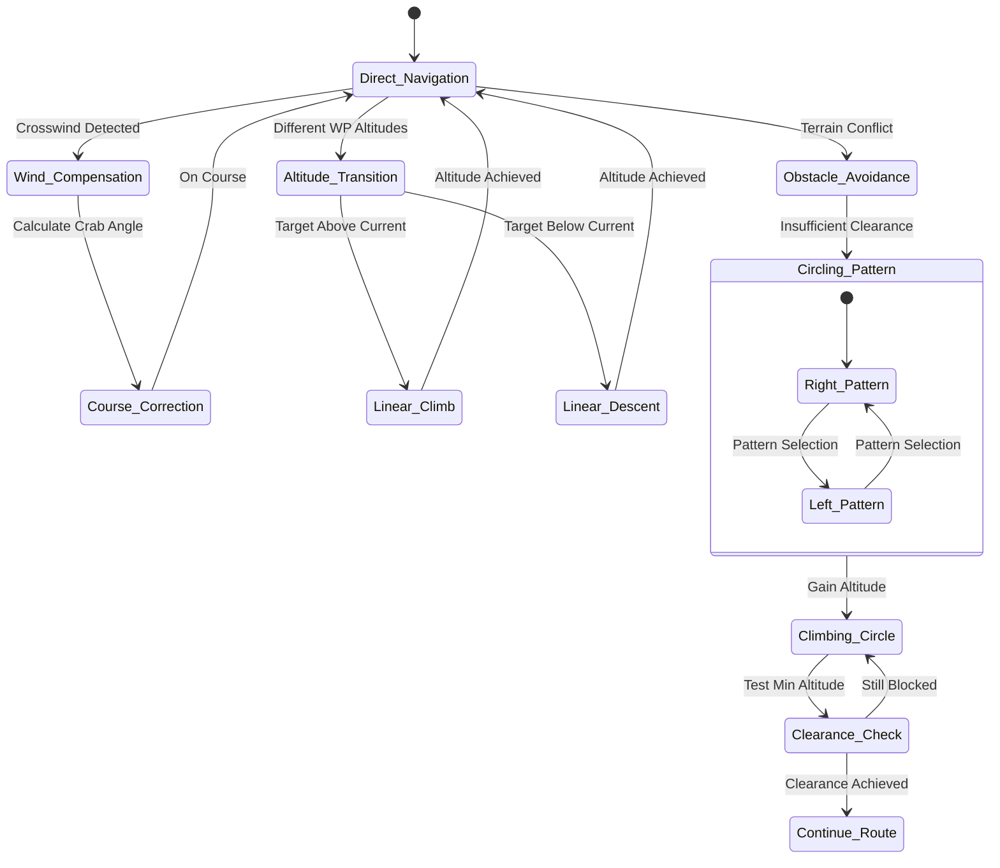
```mermaid
stateDiagram-v2
    [*] --> Direct_Navigation
    Direct_Navigation --> Wind_Compensation : Crosswind Detected
    Direct_Navigation --> Altitude_Transition : Different WP Altitudes
    Direct_Navigation --> Obstacle_Avoidance : Terrain Conflict
    
    Wind_Compensation --> Course_Correction : Calculate Crab Angle
    Course_Correction --> Direct_Navigation : On Course
    
    Altitude_Transition --> Linear_Climb : Target Above Current
    Altitude_Transition --> Linear_Descent : Target Below Current
    Linear_Climb --> Direct_Navigation : Altitude Achieved
    Linear_Descent --> Direct_Navigation : Altitude Achieved
    
    Obstacle_Avoidance --> Circling_Pattern : Insufficient Clearance
    Circling_Pattern --> Climbing_Circle : Gain Altitude
    Climbing_Circle --> Clearance_Check : Test Min Altitude
    Clearance_Check --> Continue_Route : Clearance Achieved
    Clearance_Check --> Climbing_Circle : Still Blocked
    
    state Circling_Pattern {
        [*] --> Right_Pattern
        Right_Pattern --> Left_Pattern : Pattern Selection
        Left_Pattern --> Right_Pattern : Pattern Selection
    }
```

### Manual Flight Control System

**Input Device Support:**
The flight control system supports multiple input methods with full configurability:

- **Joystick/Gamepad:** Primary flight controls (pitch, roll, yaw, throttle)
- **Yoke Systems:** Traditional aviation control feel
- **Rudder Pedals:** Dedicated yaw control and differential braking
- **Throttle Quadrants:** Multiple engine and system controls
- **Physical Buttons:** Configurable function mapping
- **Rotary Encoders:** Precision adjustment dials
- **Keyboard:** Backup and secondary controls
- **Mouse:** Alternative control method with sensitivity adjustment

---

## UI Input Management System

**Implementation Guidelines for User Interface**

*Note: This section provides implementation guidance and is not part of the saved game state data.*

### Configurable Input Mapping System

**Input Configuration Architecture:**
```json
{
  "inputMappings": {
    "flightControls": {
      "pitch": {
        "device": "joystick",
        "axis": "y",
        "inverted": false,
        "deadzone": 0.05,
        "sensitivity": 1.0,
        "curve": "linear"
      },
      "roll": {
        "device": "joystick", 
        "axis": "x",
        "inverted": false,
        "deadzone": 0.05,
        "sensitivity": 1.0,
        "curve": "linear"
      },
      "yaw": {
        "device": "rudder_pedals",
        "axis": "x",
        "inverted": false,
        "deadzone": 0.10,
        "sensitivity": 0.8,
        "curve": "exponential"
      },
      "throttle": {
        "device": "throttle_quadrant",
        "axis": "z",
        "inverted": true,
        "deadzone": 0.02,
        "sensitivity": 1.0,
        "curve": "linear"
      }
    },
    "systemControls": {
      "autopilot_heading_toggle": {
        "device": "button",
        "button": 5,
        "modifier": null,
        "action": "toggle"
      },
      "fuel_pump_forward": {
        "device": "keyboard",
        "key": "F1",
        "modifier": "shift",
        "action": "hold"
      }
    }
  }
}
```

### Stacked Modal Input System

**Modal Stack Architecture:**
The UI implements a hierarchical input system where different interface layers can capture or inherit inputs:

1. **Global Layer:** Always-active shortcuts (ESC, F-keys, emergency stops)
2. **Context Layer:** Room-specific controls (engine room vs. bridge)
3. **Widget Layer:** Focused UI elements (text input, sliders)
4. **Modal Layer:** Dialog boxes, menus, configuration screens

**Input Inheritance System:**
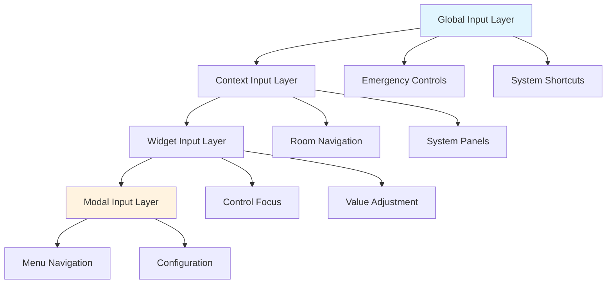
```mermaid
graph TD
    A[Global Input Layer] --> B[Context Input Layer]
    B --> C[Widget Input Layer]
    C --> D[Modal Input Layer]
    
    A --> E[Emergency Controls]
    A --> F[System Shortcuts]
    
    B --> G[Room Navigation]
    B --> H[System Panels]
    
    C --> I[Control Focus]
    C --> J[Value Adjustment]
    
    D --> K[Menu Navigation]
    D --> L[Configuration]
    
    style A fill:#e1f5fe
    style D fill:#fff3e0
```

**Focus Management:**
- **Active Inheritance:** Lower layers can block higher layer inputs
- **Focus Highlighting:** Visual indicators show which layer has control
- **Container Focus:** UI containers highlight when they receive focus
- **Input Routing:** Events route through the stack until consumed

### Input Configuration Interface

**Click-to-Configure System:**
Users can reconfigure any input by:

1. **Selection:** Click on the control to configure
2. **Activation:** Enter configuration mode
3. **Input Detection:** System waits for new input
4. **Assignment:** New input replaces old assignment
5. **Validation:** Check for conflicts and provide warnings

**Movement and Rotation Mapping:**
- **Analog Inputs:** Smooth joystick/throttle movements
- **Digital Inputs:** Keyboard key presses and releases  
- **Rotary Inputs:** Wheel/encoder rotation detection
- **Gesture Inputs:** Mouse movement patterns
- **Combination Inputs:** Multiple simultaneous inputs

**Input Curves and Sensitivity:**
- **Linear Response:** Direct 1:1 input mapping
- **Exponential Curves:** More precision around center
- **Logarithmic Curves:** Enhanced sensitivity at extremes
- **Custom Curves:** User-defined response profiles
- **Dead Zone Configuration:** Eliminate input noise

### UI Container Focus System

**Focus State Management:**
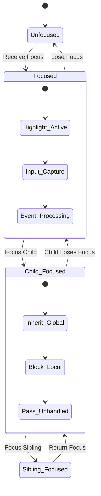
```mermaid
stateDiagram-v2
    [*] --> Unfocused
    Unfocused --> Focused : Receive Focus
    Focused --> Child_Focused : Focus Child
    Focused --> Unfocused : Lose Focus
    Child_Focused --> Focused : Child Loses Focus
    Child_Focused --> Sibling_Focused : Focus Sibling
    Sibling_Focused --> Child_Focused : Return Focus
    
    state Focused {
        [*] --> Highlight_Active
        Highlight_Active --> Input_Capture
        Input_Capture --> Event_Processing
    }
    
    state Child_Focused {
        [*] --> Inherit_Global
        Inherit_Global --> Block_Local
        Block_Local --> Pass_Unhandled
    }
```

**Visual Focus Indicators:**
- **Border Highlighting:** Active containers show colored borders
- **Background Changes:** Subtle background color shifts
- **Icon States:** Visual indicators for active/inactive states
- **Animation Cues:** Smooth transitions between focus states

**Input Event Handling:**
- **Event Capture:** Focused containers capture relevant inputs
- **Event Bubbling:** Unhandled events bubble up the hierarchy
- **Event Blocking:** Lower layers can prevent upper layer processing
- **Global Override:** Emergency controls always work regardless of focus

This input system provides maximum flexibility while maintaining intuitive operation, allowing players to configure controls exactly to their preferences while supporting a wide range of input devices and interaction methods.

---

## Engine & Power Management

The engine system simulates a realistic aircraft powerplant with multiple interdependent systems.

### Engine State Machine

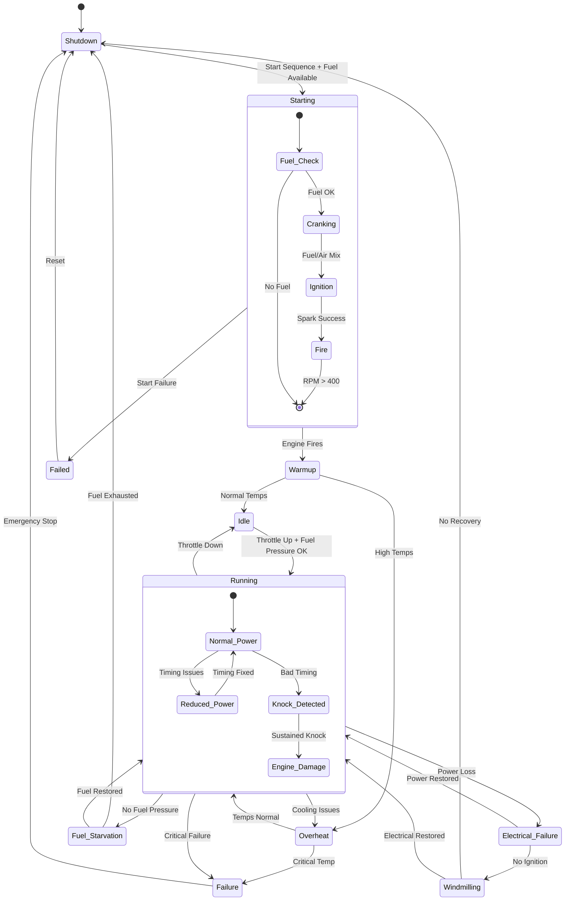
```mermaid
stateDiagram-v2
    [*] --> Shutdown
    Shutdown --> Starting : Start Sequence + Fuel Available
    Starting --> Warmup : Engine Fires
    Starting --> Failed : Start Failure
    Warmup --> Idle : Normal Temps
    Warmup --> Overheat : High Temps
    Idle --> Running : Throttle Up + Fuel Pressure OK
    Running --> Idle : Throttle Down
    Running --> Fuel_Starvation : No Fuel Pressure
    Running --> Overheat : Cooling Issues
    Running --> Electrical_Failure : Power Loss
    Running --> Failure : Critical Failure
    
    Fuel_Starvation --> Running : Fuel Restored
    Fuel_Starvation --> Shutdown : Fuel Exhausted
    Electrical_Failure --> Running : Power Restored
    Electrical_Failure --> Windmilling : No Ignition
    Overheat --> Running : Temps Normal
    Overheat --> Failure : Critical Temp
    Failure --> Shutdown : Emergency Stop
    Failed --> Shutdown : Reset
    Windmilling --> Running : Electrical Restored
    Windmilling --> Shutdown : No Recovery
    
    state Starting {
        [*] --> Fuel_Check
        Fuel_Check --> Cranking : Fuel OK
        Fuel_Check --> [*] : No Fuel
        Cranking --> Ignition : Fuel/Air Mix
        Ignition --> Fire : Spark Success
        Fire --> [*] : RPM > 400
    }
    
    state Running {
        [*] --> Normal_Power
        Normal_Power --> Reduced_Power : Timing Issues
        Normal_Power --> Knock_Detected : Bad Timing
        Reduced_Power --> Normal_Power : Timing Fixed
        Knock_Detected --> Engine_Damage : Sustained Knock
    }
```

### Engine Parameters

**Temperature Management:**
- Cylinder Head Temperature (CHT): Normal 200-400°F, Critical >450°F
- Oil Temperature: Normal 150-220°F, Critical >240°F  
- Coolant Temperature: Normal 160-200°F, Critical >220°F

**Pressure Systems:**
- Oil Pressure: Normal 40-80 PSI, Critical <20 PSI
- Fuel Pressure: Normal 15-25 PSI, Critical <10 PSI
- Manifold Pressure: Varies with throttle and altitude

**Power Output Calculation:**
```
Power = Base_Power × Throttle_Factor × Altitude_Factor × Temperature_Factor × Mixture_Factor

Where:
- Base_Power = Maximum engine power (e.g., 180 HP)
- Throttle_Factor = Throttle position (0.0 to 1.0)
- Altitude_Factor = Air density reduction with altitude
- Temperature_Factor = Temperature effects on air density
- Mixture_Factor = Fuel/air mixture efficiency (0.7 to 1.0)
```

### Electrical System

The electrical system is a complex mini-game involving physical battery management, dual bus architecture, and inventory-based battery replacement that requires strategic power distribution and maintenance planning.

**Electrical System Architecture:**

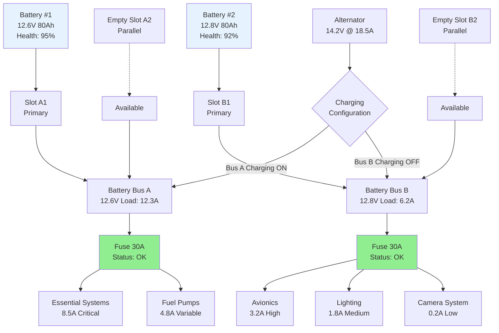
```mermaid
graph TD
    A[Battery #1<br/>12.6V 80Ah<br/>Health: 95%] --> B[Slot A1<br/>Primary]
    C[Battery #2<br/>12.8V 80Ah<br/>Health: 92%] --> D[Slot B1<br/>Primary]
    
    E[Empty Slot A2<br/>Parallel] -.-> F[Available]
    G[Empty Slot B2<br/>Parallel] -.-> H[Available]
    
    B --> I[Battery Bus A<br/>12.6V Load: 12.3A]
    F --> I
    D --> J[Battery Bus B<br/>12.8V Load: 6.2A]
    H --> J
    
    K[Alternator<br/>14.2V @ 18.5A] --> L{Charging<br/>Configuration}
    L -->|Bus A Charging ON| I
    L -->|Bus B Charging OFF| J
    
    I --> M[Fuse 30A<br/>Status: OK]
    J --> N[Fuse 30A<br/>Status: OK]
    
    M --> O[Essential Systems<br/>8.5A Critical]
    M --> P[Fuel Pumps<br/>4.8A Variable]
    N --> Q[Avionics<br/>3.2A High]
    N --> R[Lighting<br/>1.8A Medium]
    N --> S[Camera System<br/>0.2A Low]
    
    style M fill:#90EE90
    style N fill:#90EE90
    style A fill:#E6F3FF
    style C fill:#E6F3FF
```

**Battery as Physical Items:**
Each battery is a physical object with individual characteristics:

1. **Battery Properties:** Voltage, capacity, health, cycle count, temperature
2. **Installation Status:** Installed/removed, connected bus, physical position
3. **Maintenance Data:** Serial number, age, performance history
4. **Inventory Integration:** Batteries can be removed and stored as cargo items

**Battery Slot System:**
Each bus has multiple slots for battery connections:
- **Primary Slots:** Main battery connection for each bus
- **Parallel Slots:** Additional battery capacity (parallel connection)
- **Hot-Swappable:** Batteries can be changed during flight (with proper procedures)
- **Connection Types:** Primary (main power) vs. Parallel (additional capacity)

**Battery Management Mini-Game:**
Players must manage battery health, replacement, and configuration:

1. **Health Monitoring:** Track battery degradation over time
2. **Cycle Management:** Battery life decreases with charge/discharge cycles
3. **Temperature Effects:** Hot conditions reduce battery performance
4. **Strategic Replacement:** Plan battery changes during maintenance windows
5. **Capacity Planning:** Use parallel batteries for extended missions

**Battery Installation State Management:**

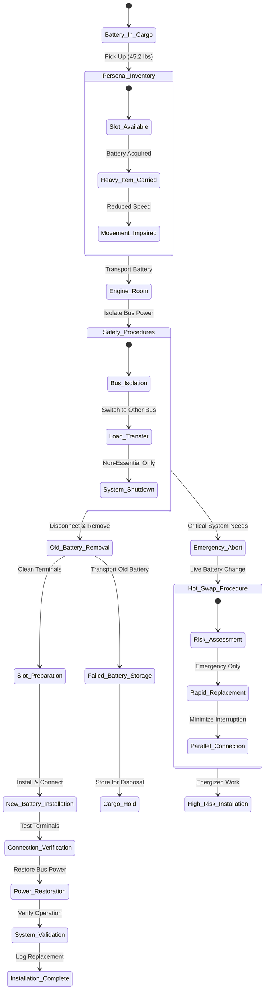
```mermaid
stateDiagram-v2
    [*] --> Battery_In_Cargo
    Battery_In_Cargo --> Personal_Inventory : Pick Up (45.2 lbs)
    Personal_Inventory --> Engine_Room : Transport Battery
    Engine_Room --> Safety_Procedures : Isolate Bus Power
    Safety_Procedures --> Old_Battery_Removal : Disconnect & Remove
    Old_Battery_Removal --> Slot_Preparation : Clean Terminals
    Slot_Preparation --> New_Battery_Installation : Install & Connect
    New_Battery_Installation --> Connection_Verification : Test Terminals
    Connection_Verification --> Power_Restoration : Restore Bus Power
    Power_Restoration --> System_Validation : Verify Operation
    System_Validation --> Installation_Complete : Log Replacement
    
    Old_Battery_Removal --> Failed_Battery_Storage : Transport Old Battery
    Failed_Battery_Storage --> Cargo_Hold : Store for Disposal
    
    Safety_Procedures --> Emergency_Abort : Critical System Needs
    Emergency_Abort --> Hot_Swap_Procedure : Live Battery Change
    Hot_Swap_Procedure --> High_Risk_Installation : Energized Work
    
    state Personal_Inventory {
        [*] --> Slot_Available
        Slot_Available --> Heavy_Item_Carried : Battery Acquired
        Heavy_Item_Carried --> Movement_Impaired : Reduced Speed
    }
    
    state Safety_Procedures {
        [*] --> Bus_Isolation
        Bus_Isolation --> Load_Transfer : Switch to Other Bus
        Load_Transfer --> System_Shutdown : Non-Essential Only
    }
    
    state Hot_Swap_Procedure {
        [*] --> Risk_Assessment
        Risk_Assessment --> Rapid_Replacement : Emergency Only
        Rapid_Replacement --> Parallel_Connection : Minimize Interruption
    }
```

**Advanced Battery Features:**
- **Parallel Configuration:** Connect multiple batteries to same bus for increased capacity
- **Load Balancing:** Distribute charging/discharging across parallel batteries
- **Battery Health Prediction:** Early warning system for battery replacement needs
- **Emergency Procedures:** Hot-swap batteries during critical situations

**Electrical Load Calculations:**
```
Bus_Voltage = Weighted_Average(Connected_Battery_Voltages)
Bus_Capacity = Sum(Connected_Battery_Capacities)
Bus_Charge = Sum(Connected_Battery_Charges)

Battery_Load_Share = Battery_Capacity / Total_Bus_Capacity
Battery_Current = Bus_Current × Battery_Load_Share

Where:
- Multiple batteries on same bus share the electrical load proportionally
- Weaker batteries (lower health) carry proportionally less load
- Temperature effects modify actual capacity and voltage output
```

**Electrical System State Management:**

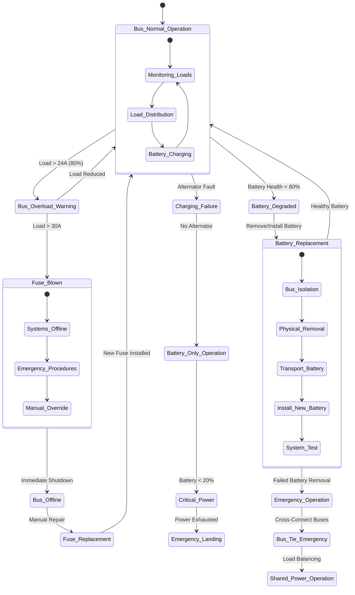
```mermaid
stateDiagram-v2
    [*] --> Bus_Normal_Operation
    
    Bus_Normal_Operation --> Bus_Overload_Warning : Load > 24A (80%)
    Bus_Normal_Operation --> Battery_Degraded : Battery Health < 80%
    Bus_Normal_Operation --> Charging_Failure : Alternator Fault
    
    Bus_Overload_Warning --> Bus_Normal_Operation : Load Reduced
    Bus_Overload_Warning --> Fuse_Blown : Load > 30A
    
    Fuse_Blown --> Bus_Offline : Immediate Shutdown
    Bus_Offline --> Fuse_Replacement : Manual Repair
    Fuse_Replacement --> Bus_Normal_Operation : New Fuse Installed
    
    Battery_Degraded --> Battery_Replacement : Remove/Install Battery
    Battery_Replacement --> Bus_Normal_Operation : Healthy Battery
    Battery_Replacement --> Emergency_Operation : Failed Battery Removal
    
    Charging_Failure --> Battery_Only_Operation : No Alternator
    Battery_Only_Operation --> Critical_Power : Battery < 20%
    Critical_Power --> Emergency_Landing : Power Exhausted
    
    Emergency_Operation --> Bus_Tie_Emergency : Cross-Connect Buses
    Bus_Tie_Emergency --> Shared_Power_Operation : Load Balancing
    
    state Bus_Normal_Operation {
        [*] --> Monitoring_Loads
        Monitoring_Loads --> Load_Distribution
        Load_Distribution --> Battery_Charging
        Battery_Charging --> Monitoring_Loads
    }
    
    state Fuse_Blown {
        [*] --> Systems_Offline
        Systems_Offline --> Emergency_Procedures
        Emergency_Procedures --> Manual_Override
    }
    
    state Battery_Replacement {
        [*] --> Bus_Isolation
        Bus_Isolation --> Physical_Removal
        Physical_Removal --> Transport_Battery
        Transport_Battery --> Install_New_Battery
        Install_New_Battery --> System_Test
    }
```

**Inventory Management Integration:**
The electrical system connects to crew inventory management:

1. **Spare Parts Storage:** Fuses stored in cargo hold
2. **Personal Inventory:** Limited carrying capacity for crew member
3. **Room-to-Room Transport:** Player must physically carry replacement parts
4. **Installation Process:** Manual fuse replacement in engine room

**Strategic Electrical Management:**
- **Pre-flight Planning:** Configure bus loads for mission requirements
- **In-flight Monitoring:** Watch for overload conditions during pump operations
- **Emergency Procedures:** Rapid load shedding when fuses blow
- **Resource Management:** Conserve spare fuses for critical situations

**Advanced Electrical Features:**
- **Load Sharing:** Distribute high loads across both buses
- **Emergency Bus Tie:** Connect buses for redundancy
- **Automatic Load Shedding:** System protection during overloads
- **Battery Health Monitoring:** Capacity degradation over time

**Pump Electrical Integration:**
Each fuel pump draws power based on its flow rate:
- **Transfer Pumps:** 2.5A maximum load each
- **Dump Pumps:** 4.0A maximum load each (emergency high flow)
- **Engine Feed:** 3.5A continuous load (essential system)
- **Variable Loading:** Electrical load proportional to pump speed

**Battery Management Strategies:**
- **Single Bus Operation:** Use one battery while charging the other
- **Load Balancing:** Distribute systems across both buses
- **Emergency Configuration:** Cross-connect buses for redundancy
- **Maintenance Mode:** Isolate systems for electrical work

This electrical system creates a dynamic resource management challenge where players must balance power consumption, pump operations, and system reliability while maintaining adequate reserves for mission completion.

### Engine Timing Mini-Game

The engine timing system is a critical mini-game that requires players to manually adjust ignition timing for optimal performance, making the engine room an active gameplay space rather than just a monitoring station.

**Timing Mechanics:**
The ignition timing affects multiple engine parameters simultaneously:

```
Power_Multiplier = 1.0 - abs(Current_Timing - Optimal_Timing) × 0.02
Fuel_Efficiency = 1.0 - abs(Current_Timing - Optimal_Timing) × 0.015
Engine_Stress = abs(Current_Timing - Optimal_Timing) × 0.05
Temperature_Factor = 1.0 + (Current_Timing - Optimal_Timing) × 0.003
```

**Dynamic Timing Requirements:**
Optimal timing changes based on operating conditions:
- **Altitude Effects:** Higher altitude requires advanced timing (thinner air)
- **Temperature Effects:** Hot weather requires retarded timing (prevent knock)
- **Load Effects:** Heavy load requires slightly advanced timing
- **Fuel Quality:** Poor fuel requires retarded timing (prevent detonation)

**Engine Timing State Management:**

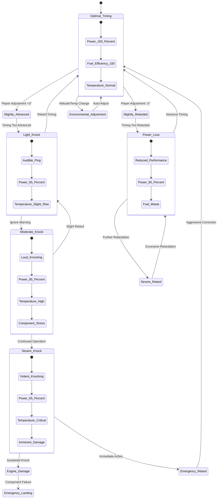
```mermaid
stateDiagram-v2
    [*] --> Optimal_Timing
    Optimal_Timing --> Slightly_Advanced : Player Adjustment +3°
    Optimal_Timing --> Slightly_Retarded : Player Adjustment -3°
    
    Slightly_Advanced --> Light_Knock : Timing Too Advanced
    Slightly_Retarded --> Power_Loss : Timing Too Retarded
    
    Light_Knock --> Optimal_Timing : Retard Timing
    Light_Knock --> Moderate_Knock : Ignore Warning
    Power_Loss --> Optimal_Timing : Advance Timing
    Power_Loss --> Severe_Retard : Further Retardation
    
    Moderate_Knock --> Severe_Knock : Continued Operation
    Moderate_Knock --> Light_Knock : Slight Retard
    Severe_Knock --> Engine_Damage : Sustained Knock
    Severe_Knock --> Emergency_Retard : Immediate Action
    
    Emergency_Retard --> Optimal_Timing : Aggressive Correction
    Severe_Retard --> Power_Loss : Excessive Retardation
    Engine_Damage --> Emergency_Landing : Component Failure
    
    Optimal_Timing --> Environmental_Adjustment : Altitude/Temp Change
    Environmental_Adjustment --> Optimal_Timing : Auto-Adjust
    
    state Optimal_Timing {
        [*] --> Power_100_Percent
        Power_100_Percent --> Fuel_Efficiency_100
        Fuel_Efficiency_100 --> Temperature_Normal
    }
    
    state Light_Knock {
        [*] --> Audible_Ping
        Audible_Ping --> Power_95_Percent
        Power_95_Percent --> Temperature_Slight_Rise
    }
    
    state Moderate_Knock {
        [*] --> Loud_Knocking
        Loud_Knocking --> Power_85_Percent
        Power_85_Percent --> Temperature_High
        Temperature_High --> Component_Stress
    }
    
    state Severe_Knock {
        [*] --> Violent_Knocking
        Violent_Knocking --> Power_65_Percent
        Power_65_Percent --> Temperature_Critical
        Temperature_Critical --> Imminent_Damage
    }
    
    state Power_Loss {
        [*] --> Reduced_Performance
        Reduced_Performance --> Power_90_Percent
        Power_90_Percent --> Fuel_Waste
    }
```

**Timing Adjustment Interface:**
Players use engine instrumentation to make timing adjustments:

1. **Audio Cues:** Engine knock produces distinct audio signatures
2. **Performance Monitoring:** EGT, CHT, and power output indicators
3. **Timing Gauge:** Shows current timing relative to optimal range
4. **Historical Data:** Performance graphs showing timing adjustment effects

**Mini-Game Strategy:**
- **Pre-flight Setup:** Set timing for expected conditions
- **In-flight Monitoring:** Listen for knock, watch temperatures
- **Proactive Adjustment:** Anticipate changes due to altitude/weather
- **Emergency Response:** Quick timing retard if knock detected
- **Performance Optimization:** Fine-tune for maximum efficiency

**Advanced Timing Features:**
- **Automatic vs Manual Mode:** Players can choose control level
- **Timing Curves:** Advanced players can set altitude-based curves
- **Maintenance Effects:** Worn components affect timing stability
- **Fuel Grade Compensation:** Different fuel types require timing changes

**Consequences of Poor Timing:**
- **Too Advanced:** Engine knock, overheating, potential engine damage
- **Too Retarded:** Power loss, poor fuel economy, carbon buildup
- **Constant Changes:** Engine wear, unreliable performance
- **Ignored Knock:** Progressive engine damage leading to failure

This timing mini-game transforms engine management from passive monitoring into active piloting skill, requiring players to understand the relationship between engine parameters and make real-time adjustments for optimal performance.

---

## Fuel Management Mini-Game

The fuel system is a complex mini-game involving directional fuel transfer pumps and longitudinal balance management for optimal airship performance.

### Fuel System Architecture

**Tank Configuration:**
- **Forward Tank:** Located at station 142.0, affects nose-heavy balance
- **Center Tank:** Located at station 158.0, optimal balance point and engine feed
- **Aft Tank:** Located at station 174.0, affects tail-heavy balance

**Directional Pump System:**
The fuel system uses a directed graph model where pumps can transfer fuel between any tanks:

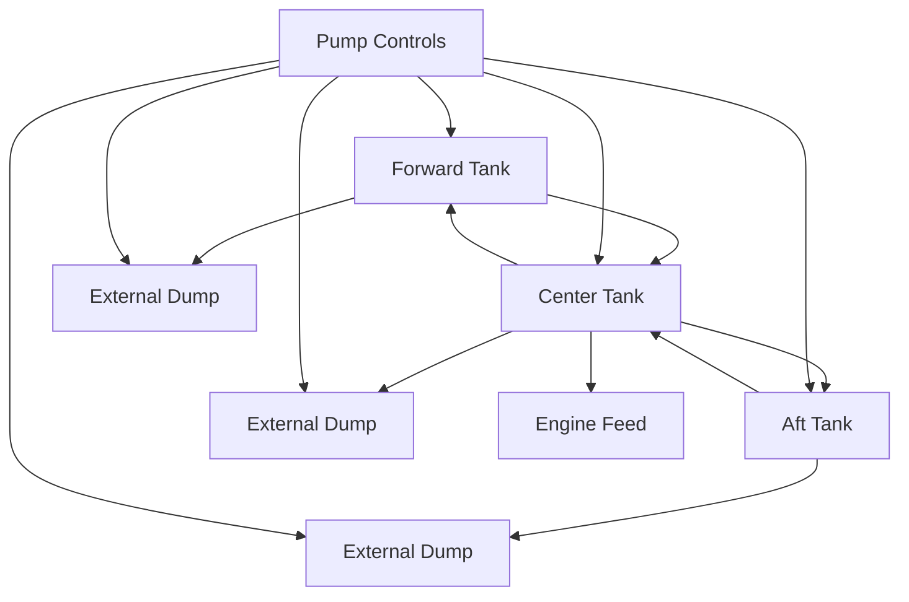
```mermaid
graph TD
    A[Forward Tank] --> B[Center Tank]
    B --> A
    B --> C[Aft Tank]
    C --> B
    
    A --> D[External Dump]
    B --> E[External Dump]
    C --> F[External Dump]
    
    B --> G[Engine Feed]
    
    H[Pump Controls] --> A
    H --> B
    H --> C
    H --> D
    H --> E
    H --> F
```

**Fuel Balance Calculations:**
```
Fuel_Balance_Position = Σ(Tank_Level × Tank_Arm) / Total_Fuel_Weight

Balance_Offset = Fuel_Balance_Position - Optimal_Balance_Position

Airspeed_Penalty = min(Max_Penalty, log₁₀(1 + abs(Balance_Offset) / Max_Offset) × Penalty_Factor)

Where:
- Tank_Level = Current fuel quantity in tank (gallons)
- Tank_Arm = Distance from aircraft datum (inches)
- Optimal_Balance_Position = 158.0 inches (center tank position)
- Max_Offset = 25.0 inches (maximum acceptable imbalance)
- Max_Penalty = 0.35 (35% maximum airspeed reduction)
- Penalty_Factor = Scaling factor for logarithmic curve
```

### Fuel Management Gameplay

**Balance Mini-Game Mechanics:**
Players must actively manage fuel distribution to maintain optimal balance:

1. **Continuous Monitoring:** Balance shifts as fuel is consumed
2. **Proactive Transfer:** Move fuel before imbalance becomes critical
3. **Emergency Procedures:** Rapid rebalancing during flight
4. **Strategic Planning:** Pre-flight fuel loading for mission profile

**Pump Control Interface:**
Each pump has user-controlled flow levels:
- **Flow Level:** 0.0 to 1.0 (fraction of maximum pump capacity)
- **Real-time Adjustment:** Players can change pump speeds during flight
- **Multiple Simultaneous Pumps:** Complex transfer operations possible
- **Pump Failures:** System reliability adds challenge

**Fuel System State Management:**

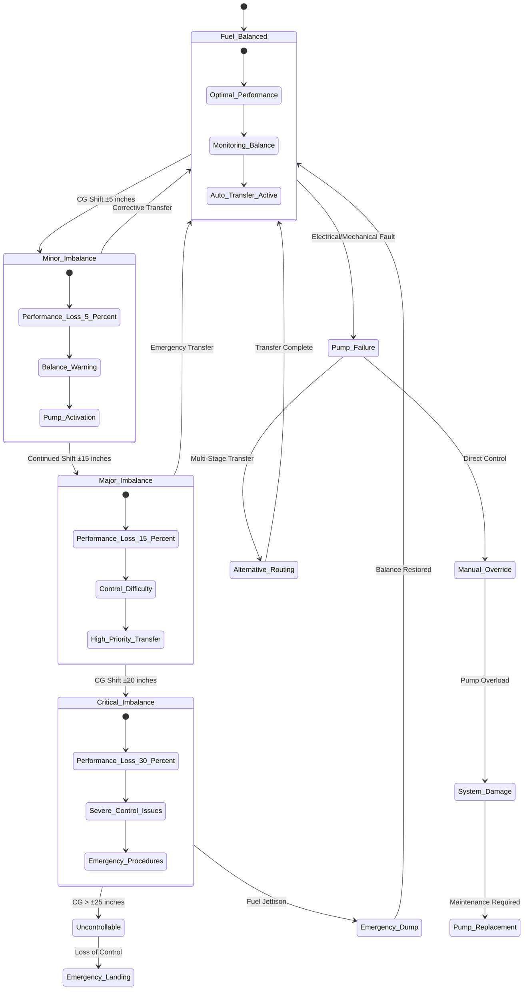
```mermaid
stateDiagram-v2
    [*] --> Fuel_Balanced
    
    Fuel_Balanced --> Minor_Imbalance : CG Shift ±5 inches
    Minor_Imbalance --> Fuel_Balanced : Corrective Transfer
    Minor_Imbalance --> Major_Imbalance : Continued Shift ±15 inches
    
    Major_Imbalance --> Critical_Imbalance : CG Shift ±20 inches
    Major_Imbalance --> Fuel_Balanced : Emergency Transfer
    
    Critical_Imbalance --> Uncontrollable : CG > ±25 inches
    Critical_Imbalance --> Emergency_Dump : Fuel Jettison
    
    Emergency_Dump --> Fuel_Balanced : Balance Restored
    Uncontrollable --> Emergency_Landing : Loss of Control
    
    Fuel_Balanced --> Pump_Failure : Electrical/Mechanical Fault
    Pump_Failure --> Alternative_Routing : Multi-Stage Transfer
    Pump_Failure --> Manual_Override : Direct Control
    
    Alternative_Routing --> Fuel_Balanced : Transfer Complete
    Manual_Override --> System_Damage : Pump Overload
    System_Damage --> Pump_Replacement : Maintenance Required
    
    state Fuel_Balanced {
        [*] --> Optimal_Performance
        Optimal_Performance --> Monitoring_Balance
        Monitoring_Balance --> Auto_Transfer_Active
    }
    
    state Minor_Imbalance {
        [*] --> Performance_Loss_5_Percent
        Performance_Loss_5_Percent --> Balance_Warning
        Balance_Warning --> Pump_Activation
    }
    
    state Major_Imbalance {
        [*] --> Performance_Loss_15_Percent
        Performance_Loss_15_Percent --> Control_Difficulty
        Control_Difficulty --> High_Priority_Transfer
    }
    
    state Critical_Imbalance {
        [*] --> Performance_Loss_30_Percent
        Performance_Loss_30_Percent --> Severe_Control_Issues
        Severe_Control_Issues --> Emergency_Procedures
    }
```

**Strategic Fuel Management:**
- **Mission Planning:** Calculate fuel distribution for different flight phases
- **Weight Shifts:** Account for cargo and passenger movement
- **Consumption Patterns:** Engine feed affects balance over time
- **Emergency Reserves:** Maintain balanced reserves in all tanks

**Advanced Pump Operations:**
- **Cross-Flow Pumping:** Move fuel through center tank to opposite end
- **Simultaneous Transfers:** Multiple pumps operating at once
- **Flow Rate Optimization:** Balance transfer speed vs. electrical load
- **Pump Scheduling:** Timed transfers for optimal efficiency

### Fuel System Failures

**Pump Failure Scenarios:**
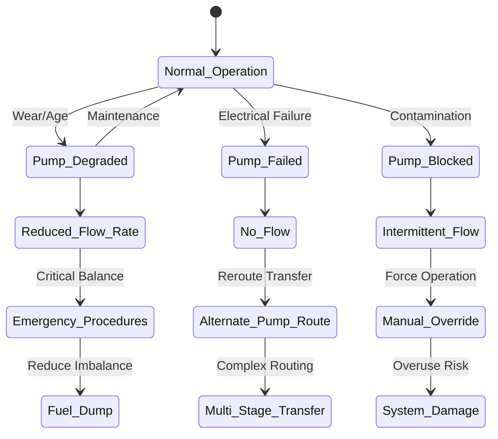
```mermaid
stateDiagram-v2
    [*] --> Normal_Operation
    Normal_Operation --> Pump_Degraded : Wear/Age
    Normal_Operation --> Pump_Failed : Electrical Failure
    Normal_Operation --> Pump_Blocked : Contamination
    
    Pump_Degraded --> Reduced_Flow_Rate
    Pump_Failed --> No_Flow
    Pump_Blocked --> Intermittent_Flow
    
    Pump_Degraded --> Normal_Operation : Maintenance
    Reduced_Flow_Rate --> Emergency_Procedures : Critical Balance
    No_Flow --> Alternate_Pump_Route : Reroute Transfer
    Intermittent_Flow --> Manual_Override : Force Operation
    
    Emergency_Procedures --> Fuel_Dump : Reduce Imbalance
    Alternate_Pump_Route --> Multi_Stage_Transfer : Complex Routing
    Manual_Override --> System_Damage : Overuse Risk
```

**Emergency Fuel Procedures:**
- **Rapid Dump:** Emergency fuel jettison to restore balance
- **Alternative Routing:** Use multiple pumps when direct transfer fails
- **Manual Fuel Management:** Direct control when automation fails
- **Balance Recovery:** Systematic approach to restore optimal CG

**Performance Impact Details:**
The logarithmic airspeed penalty creates realistic flight characteristics:
- **Small Imbalances:** Minimal impact, easily corrected
- **Moderate Imbalances:** Noticeable performance loss, requires attention
- **Large Imbalances:** Significant speed reduction, handling difficulties
- **Extreme Imbalances:** Flight safety compromised, emergency situation

### System Interconnection Matrix

Rather than creating recursive Mermaid diagrams for every possible system interaction, the following matrix shows critical dependencies and failure cascades:

| Primary System | Secondary System | Failure Mode | Cascade Effect | Recovery Action |
|----------------|------------------|--------------|----------------|-----------------|
| **Battery Bus A** | Engine Feed Pump | Fuse blown | Engine fuel starvation | Replace fuse + restore fuel pressure |
| **Battery Bus A** | Transfer Pumps | Power loss | Fuel imbalance worsens | Switch to Bus B pumps + manual balance |
| **Battery Bus B** | Dump Pumps | Fuse blown | Cannot jettison fuel | Emergency landing + manual dump |
| **Battery Bus B** | Avionics | Power loss | Navigation/comm failure | Switch to backup + emergency procedures |
| **Engine Feed Pump** | Engine | No fuel pressure | Engine shutdown | Alternative fuel source + restart |
| **Center Tank** | Engine | Fuel exhausted | Power loss | Transfer from other tanks + restart |
| **Alternator** | Both Buses | Charging failure | Battery depletion | Load shedding + emergency landing |
| **Forward Tank Pump** | Fuel Balance | Transfer failure | CG shift forward | Use alternate routing via center tank |
| **Aft Tank Pump** | Fuel Balance | Transfer failure | CG shift aft | Use alternate routing via center tank |
| **Battery Health** | System Capacity | Degraded battery | Reduced reserve power | Hot-swap battery during flight |

**Critical Failure Scenarios:**

1. **Total Electrical Failure:** Both buses fail → Engine windmilling → Emergency landing
2. **Fuel System Failure:** All pumps fail → Severe imbalance → Control difficulty
3. **Engine Failure + Imbalance:** No power + bad CG → Immediate emergency landing
4. **Battery Depletion:** No charging + high load → Progressive system shutdown

**System Priority During Emergencies:**
1. **Critical:** Engine feed pump, essential systems
2. **High:** Flight controls, basic navigation, fuel transfer pumps
3. **Medium:** Communications, lighting, advanced avionics  
4. **Low:** Camera system, non-essential equipment, comfort systems

This matrix approach captures the essential system relationships without requiring complex multi-dimensional diagrams, while still providing clear guidance for failure management and recovery procedures.

---

## Cargo Management Mini-Game

The cargo system involves weight, balance, and logistics management.

### Weight & Balance System

**Center of Gravity Calculations:**
```
CG_Position = Σ(Item_Weight × Item_Arm) / Total_Weight

Where:
- Item_Weight = Weight of each cargo item
- Item_Arm = Distance from reference datum
- Total_Weight = Sum of all weights including aircraft empty weight
```

**Weight & Balance Limits:**
- Forward CG Limit: Minimum controllability
- Aft CG Limit: Maximum controllability  
- Maximum Gross Weight: Structural limitation
- Compartment Weight Limits: Load distribution

### Cargo Loading Mini-Game

**Loading Strategy:**
Players must consider:
1. **Weight Distribution:** Balance cargo across compartments
2. **Fragile Items:** Secure delicate equipment properly
3. **Access Requirements:** Items needed in-flight must be accessible
4. **Emergency Considerations:** Weight shifting in turbulence

**Cargo States:**
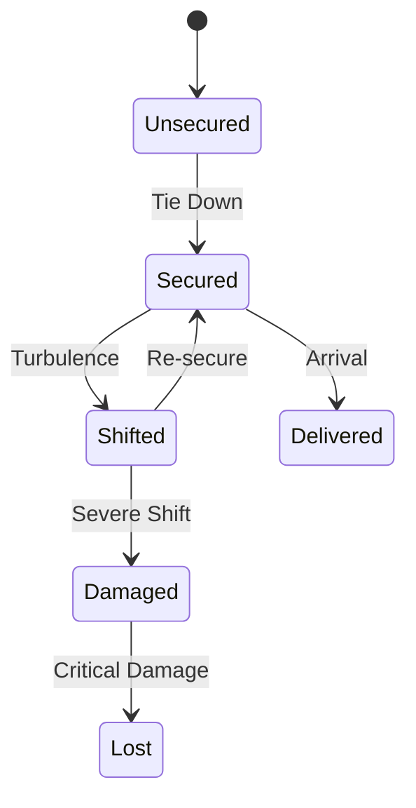
```mermaid
stateDiagram-v2
    [*] --> Unsecured
    Unsecured --> Secured : Tie Down
    Secured --> Shifted : Turbulence
    Shifted --> Damaged : Severe Shift
    Shifted --> Secured : Re-secure
    Damaged --> Lost : Critical Damage
    Secured --> Delivered : Arrival
```

**Mini-Game Mechanics:**
- **2D Loading Interface:** Visual cargo placement
- **Real-time CG Calculator:** Live balance feedback
- **Turbulence Effects:** Cargo shifting simulation
- **Inspection System:** Pre-flight cargo checks
- **Manifest Management:** Track deliveries and pickups

---

## Communications System

The communications system simulates realistic aviation radio procedures and air traffic control interactions.

### Radio System Architecture

**Multiple Radio Setup:**
- COM1: Primary communication radio
- COM2: Secondary/backup communication  
- NAV1: Navigation radio (VOR/ILS)
- Transponder: Air traffic control identification

**Frequency Management:**
- Active/Standby frequency system
- Quick frequency swaps
- Memory presets for common frequencies
- Emergency frequency (121.5 MHz) quick access

### ATC Communication Simulation

**Standard Aviation Phraseology:**
The game teaches proper radio procedures:
- Aircraft identification format
- Standard position reports
- Request procedures (altitude changes, route deviations)
- Emergency declarations

**Traffic Awareness:**
- Other aircraft position reports
- Collision avoidance advisories
- Traffic pattern procedures
- Controlled airspace compliance

---

## Camera & Photography

The camera system transforms the airship into an aerial photography platform.

### Camera Equipment Simulation

**Professional Camera Setup:**
- High-resolution digital cameras
- Stabilized gimbal systems
- GPS geotagging capability
- Multiple shooting modes (single, burst, time-lapse)

**Gimbal Control System:**
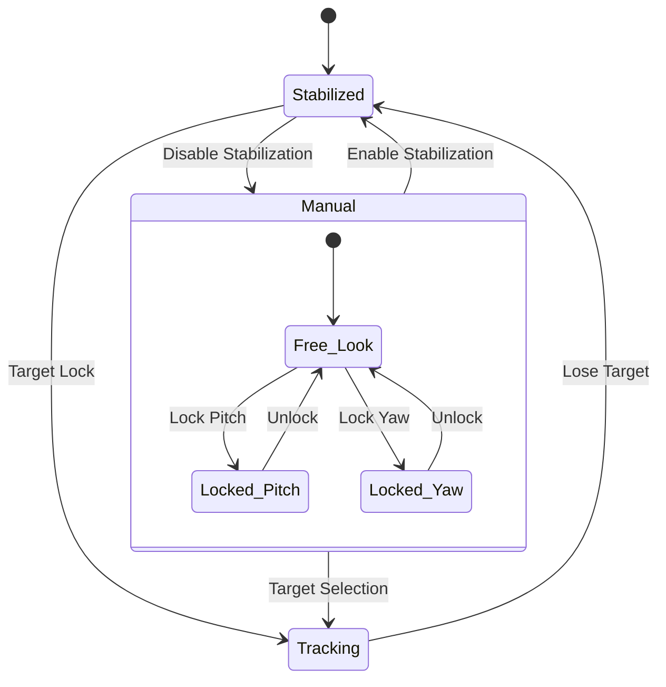
```mermaid
stateDiagram-v2
    [*] --> Stabilized
    Stabilized --> Manual : Disable Stabilization
    Manual --> Stabilized : Enable Stabilization
    Stabilized --> Tracking : Target Lock
    Tracking --> Stabilized : Lose Target
    Manual --> Tracking : Target Selection
    
    state Manual {
        [*] --> Free_Look
        Free_Look --> Locked_Pitch : Lock Pitch
        Free_Look --> Locked_Yaw : Lock Yaw
        Locked_Pitch --> Free_Look : Unlock
        Locked_Yaw --> Free_Look : Unlock
    }
```

### Photography Mission System

**Mission Types:**
1. **Survey Photography:** Systematic area coverage
2. **Artistic Shots:** Creative composition challenges  
3. **Documentation:** Specific target photography
4. **Time-lapse:** Extended duration captures

**Quality Assessment:**
- **Composition Scoring:** Rule of thirds, leading lines
- **Technical Quality:** Focus, exposure, stability
- **Coverage Requirements:** Overlap, resolution, angle
- **Timing Factors:** Lighting conditions, shadows

---

## Crew Management

The crew system models pilot fatigue, experience, and skill development.

### Pilot Progression System

**Experience Categories:**
- **Total Flight Hours:** Overall flying experience
- **Aircraft Type Hours:** Specific to airship operations
- **Instrument Hours:** IFR flight experience
- **Night Hours:** Low visibility operations

**Fatigue Management:**
```mermaid
graph TD
    A[Well Rested] --> B[Alert]
    B --> C[Slightly Tired]
    C --> D[Moderately Fatigued]
    D --> E[Severely Fatigued]
    E --> F[Dangerous Fatigue]
    
    F --> A : Extended Rest
    E --> A : Long Rest
    D --> B : Short Rest
    C --> B : Brief Rest
    
    A --> G[Performance Penalty: 0%]
    B --> H[Performance Penalty: 5%]
    C --> I[Performance Penalty: 15%]
    D --> J[Performance Penalty: 30%]
    E --> K[Performance Penalty: 50%]
    F --> L[Performance Penalty: 75%]
```

**Skill Development:**
- **Precision Flying:** Improved control responsiveness
- **Weather Recognition:** Better weather assessment
- **Emergency Procedures:** Faster emergency response
- **Fuel Management:** More efficient fuel planning

### Logbook System

**Flight Recording:**
- Automatic flight time logging
- Route and weather condition recording
- Performance metrics tracking
- Certification progress monitoring

### Inventory & Maintenance System

The crew inventory system enables room-to-room transport of tools and spare parts for aircraft maintenance and emergency repairs.

**Personal Inventory Management:**
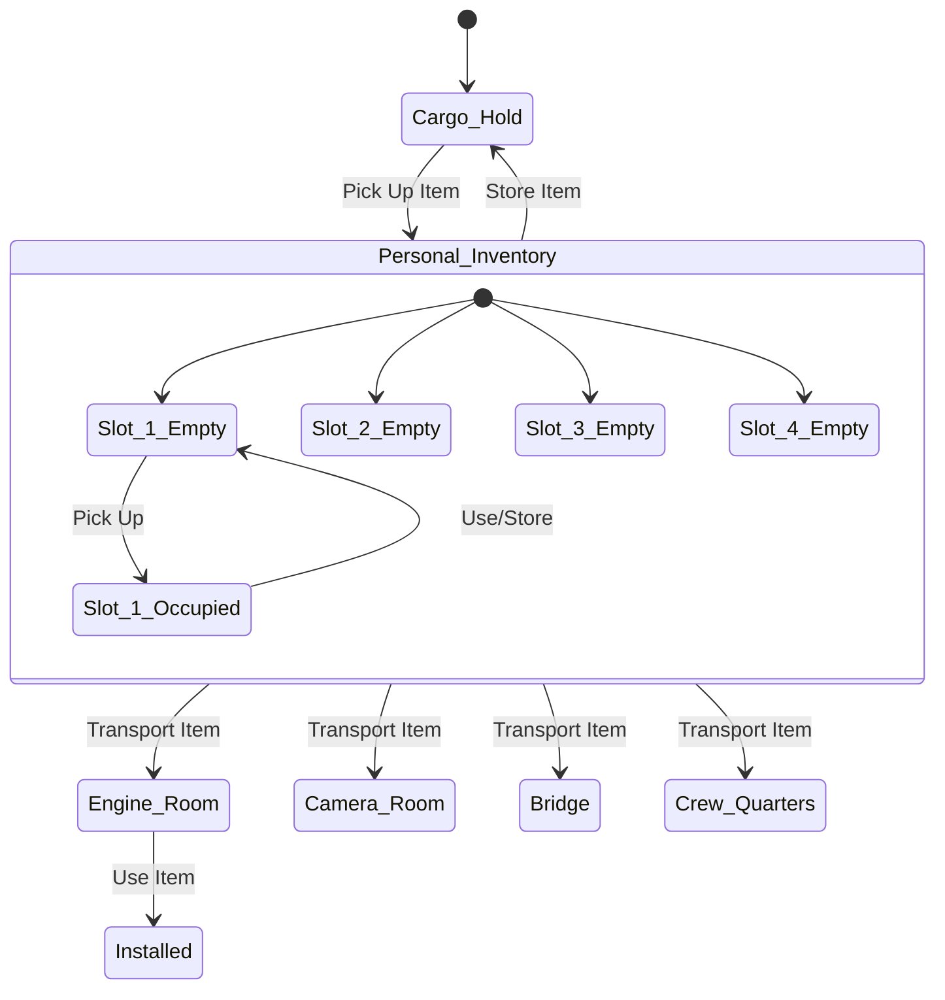
```mermaid
stateDiagram-v2
    [*] --> Cargo_Hold
    Cargo_Hold --> Personal_Inventory : Pick Up Item
    Personal_Inventory --> Engine_Room : Transport Item
    Personal_Inventory --> Camera_Room : Transport Item
    Personal_Inventory --> Bridge : Transport Item
    Personal_Inventory --> Crew_Quarters : Transport Item
    
    Engine_Room --> Installed : Use Item
    Personal_Inventory --> Cargo_Hold : Store Item
    
    state Personal_Inventory {
        [*] --> Slot_1_Empty
        [*] --> Slot_2_Empty
        [*] --> Slot_3_Empty
        [*] --> Slot_4_Empty
        
        Slot_1_Empty --> Slot_1_Occupied : Pick Up
        Slot_1_Occupied --> Slot_1_Empty : Use/Store
    }
```

**Maintenance Workflow:**
1. **Problem Identification:** Battery failure or degraded performance detected
2. **Inventory Assessment:** Check personal inventory and cargo for replacement battery
3. **Safety Procedures:** Isolate electrical bus before battery removal
4. **Physical Removal:** Disconnect and remove failed battery (45.2 lbs)
5. **Transport:** Carry replacement battery from cargo hold to engine bay
6. **Installation:** Connect new battery to appropriate bus slot
7. **System Testing:** Verify electrical system restoration and battery integration

**Battery-Specific Procedures:**
- **Heavy Item Handling:** Batteries weigh 45.2 lbs, requiring careful transport
- **Electrical Safety:** Bus isolation required before battery work
- **Slot Configuration:** Choose primary vs. parallel connection slots
- **Health Assessment:** Evaluate old battery for repair vs. disposal
- **Performance Testing:** Verify new battery integration with bus systems

**Item Categories:**
- **Tools:** Multimeter, screwdrivers, electrical test equipment, battery hydrometer
- **Spare Parts:** Fuses, circuit breakers, electrical connectors, battery terminals
- **Batteries:** Lead acid batteries (80Ah, 45.2 lbs each)
- **Emergency Supplies:** Backup components for critical systems
- **Consumables:** Items that are used up during repairs

**Inventory Constraints:**
- **Slot Limitations:** Maximum 4 items in personal inventory
- **Weight Considerations:** Heavy batteries (45.2 lbs) affect movement speed significantly
- **Physical Size:** Batteries require careful handling through narrow passages
- **Accessibility:** Engine bay battery compartments require specific access procedures
- **Priority Systems:** Critical repairs take precedence over routine maintenance

**Battery Logistics Challenges:**
- **Weight Management:** Batteries are among the heaviest portable items
- **Two-Person Operations:** Some battery installations may require assistance
- **Emergency Replacement:** Hot-swap procedures during flight emergencies
- **Capacity Planning:** Parallel battery installation for extended missions
- **Health Monitoring:** Regular battery testing and preventive replacement

**Room-to-Room Logistics:**
- **Bridge:** Central command location with system status displays
- **Engine Room:** Primary location for electrical panel access
- **Cargo Hold:** Storage location for spare parts and tools
- **Camera Room:** Secondary electrical systems and equipment
- **Crew Quarters:** Personal storage and rest area

This inventory system transforms maintenance from simple menu interactions into a physical logistics challenge requiring planning, movement, and resource management.

---

## Book Collection & Personal Library

The book system adds a literary collection mini-game where players discover, collect, read, and manage books found during missions or cargo pickups.

### Book System Architecture

**Book as Physical Items:**
Each book is a unique physical object with comprehensive metadata:

1. **Physical Properties:** Weight, fragility, cover colors
2. **Content Data:** Markdown text with embedded images
3. **Metadata:** Author, creation date, modification history
4. **Library Status:** Personal library vs. cargo storage

**Book Data Structure:**
```json
{
  "id": "unique_book_identifier",
  "name": "Book Title",
  "type": "book",
  "weight": 2.4,
  "author": "Author Name",
  "creationDate": "2023-09-12",
  "lastModified": "2025-07-27T14:45:32Z",
  "coverColor": "#7C2D12",
  "coverInkColor": "#FED7AA",
  "contents": "# Title\n\nMarkdown content with embedded images...",
  "readingProgress": 0.65,
  "bookmarks": ["page_12", "page_45"],
  "personalNotes": ["Interesting technique on p.23", "Try this method"],
  "editHistory": [
    {
      "timestamp": "2025-07-27T14:45:32Z",
      "editor": "Sarah Mitchell",
      "changes": "Added personal notes to Chapter 3"
    }
  ]
}
```

### Personal Library System

**Library Management:**
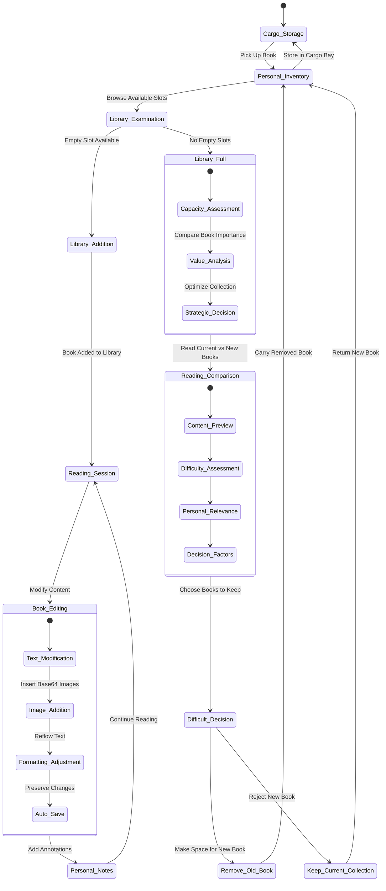
```mermaid
stateDiagram-v2
    [*] --> Cargo_Storage
    Cargo_Storage --> Personal_Inventory : Pick Up Book
    Personal_Inventory --> Library_Examination : Browse Available Slots
    Library_Examination --> Library_Full : No Empty Slots
    Library_Examination --> Library_Addition : Empty Slot Available
    
    Library_Full --> Reading_Comparison : Read Current vs New Books
    Reading_Comparison --> Difficult_Decision : Choose Books to Keep
    Difficult_Decision --> Remove_Old_Book : Make Space for New Book
    Difficult_Decision --> Keep_Current_Collection : Reject New Book
    
    Remove_Old_Book --> Personal_Inventory : Carry Removed Book
    Personal_Inventory --> Cargo_Storage : Store in Cargo Bay
    Library_Addition --> Reading_Session : Book Added to Library
    Keep_Current_Collection --> Personal_Inventory : Return New Book
    
    Reading_Session --> Book_Editing : Modify Content
    Book_Editing --> Personal_Notes : Add Annotations
    Personal_Notes --> Reading_Session : Continue Reading
    
    state Library_Full {
        [*] --> Capacity_Assessment
        Capacity_Assessment --> Value_Analysis : Compare Book Importance
        Value_Analysis --> Strategic_Decision : Optimize Collection
    }
    
    state Reading_Comparison {
        [*] --> Content_Preview
        Content_Preview --> Difficulty_Assessment
        Difficulty_Assessment --> Personal_Relevance
        Personal_Relevance --> Decision_Factors
    }
    
    state Book_Editing {
        [*] --> Text_Modification
        Text_Modification --> Image_Addition : Insert Base64 Images
        Image_Addition --> Formatting_Adjustment : Reflow Text
        Formatting_Adjustment --> Auto_Save : Preserve Changes
    }
```

**Library Constraints:**
- **Maximum 12 books** in personal library shelves
- **Physical weight considerations:** Books add aircraft weight
- **Accessibility:** Only library books available during flight
- **Organization:** 3 shelves × 4 books per shelf arrangement

### Book Collection Mini-Game

**Discovery Mechanics:**
Players encounter books through multiple sources:

1. **Cargo Pickups:** Books included in cargo manifests
2. **Mission Rewards:** Rare books as mission completion bonuses
3. **Trading:** Exchange books with other pilots
4. **Found Items:** Books discovered in abandoned aircraft

**Collection Challenges:**
- **Limited Space:** Must choose which books to keep
- **Weight Management:** Books affect aircraft performance
- **Content Value:** Assess book usefulness vs. entertainment
- **Rarity Factors:** Some books are unique or historically significant

**Reading Interface:**
- **Fixed-width font:** Roboto Mono for consistent formatting
- **Page system:** Content automatically flows to pages
- **Configurable settings:** Font size, line spacing, page width
- **Reading progress:** Automatic bookmark and progress tracking

### Content Management System

**Book Editing Features:**
Players can modify any book content:

1. **Text Editing:** Full markdown editing capability
2. **Image Insertion:** Base64-encoded PNG images supported
3. **Personal Annotations:** Add notes and observations
4. **Content Organization:** Restructure chapters and sections

**Markdown Support:**
- **Headers:** Multiple levels for organization
- **Lists:** Bullet points and numbered items
- **Tables:** Structured data presentation
- **Code blocks:** Technical information formatting
- **Images:** Inline base64-encoded graphics
- **Emphasis:** Bold, italic, and combined formatting

**Auto-Reflow System:**
- **Dynamic pagination:** Content adapts to page size settings
- **Line breaking:** Maintains readability with fixed-width font
- **Image handling:** Embedded images scale appropriately
- **Table formatting:** Maintains column alignment

### Strategic Library Management

**Book Value Assessment:**
Players must evaluate books based on:

1. **Practical Value:** Technical manuals vs. entertainment
2. **Rarity:** Unique or historically significant books
3. **Personal Interest:** Individual reading preferences
4. **Reference Utility:** Books needed for specific missions

**Collection Strategies:**
- **Specialized Libraries:** Focus on specific topics (aviation, weather, etc.)
- **Balanced Collections:** Mix of technical and personal interest books
- **Trading Networks:** Exchange books with other pilots
- **Digital Archives:** Save important content before discarding books

**Advanced Features:**
- **Search Function:** Find specific content across all books
- **Cross-References:** Link related information between books
- **Reading Statistics:** Track time spent with each book
- **Community Sharing:** Share book recommendations with other players

### Book Categories

**Technical Manuals:**
- Aircraft systems and maintenance
- Weather and navigation guides
- Emergency procedures
- Regulatory handbooks

**Personal Narratives:**
- Pilot memoirs and experiences
- Historical aviation accounts
- Adventure and travel stories
- Personal journals and logbooks

**Reference Materials:**
- Photography guides
- Engineering handbooks
- Geographical references
- Scientific studies

**Entertainment:**
- Fiction novels
- Poetry collections
- Art and culture books
- Hobby and interest guides

**Blank Books:**
- Personal journals
- Flight logbooks
- Maintenance records
- Custom note-taking

This book collection system creates a unique literary dimension to the game, encouraging players to engage with content while managing physical constraints and making strategic decisions about their personal library.

---

## Mission System

The mission system provides structured gameplay objectives and economic progression.

### Mission Categories

**Photography Missions:**
- Geological surveys
- Real estate photography
- Event coverage
- Artistic projects

**Cargo Missions:**
- Emergency supply delivery
- Regular freight transport
- Time-sensitive deliveries
- Remote area access

**Training Missions:**
- Navigation exercises
- Emergency procedure practice
- Weather flying training
- Precision flying challenges

### Mission Progression

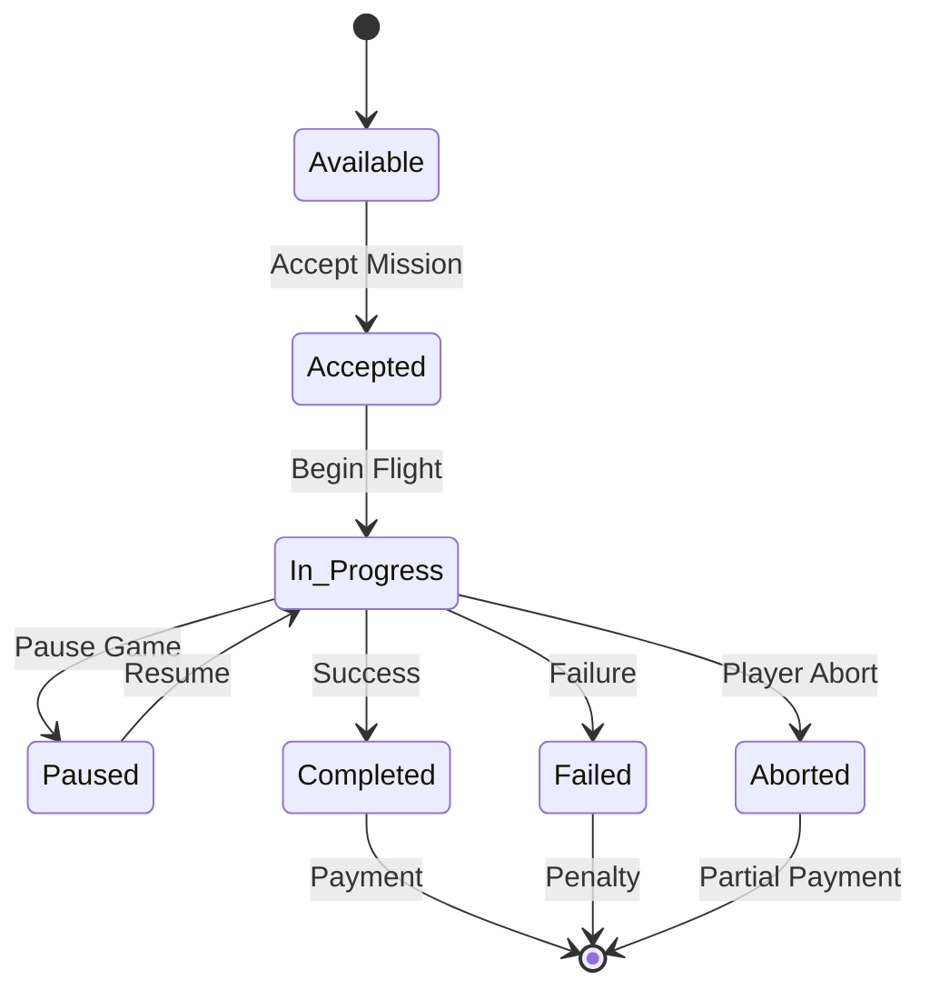
```mermaid
stateDiagram-v2
    [*] --> Available
    Available --> Accepted : Accept Mission
    Accepted --> In_Progress : Begin Flight
    In_Progress --> Paused : Pause Game
    Paused --> In_Progress : Resume
    In_Progress --> Completed : Success
    In_Progress --> Failed : Failure
    In_Progress --> Aborted : Player Abort
    Completed --> [*] : Payment
    Failed --> [*] : Penalty
    Aborted --> [*] : Partial Payment
```

**Success Criteria:**
- **Time Limits:** Complete within specified timeframe
- **Quality Requirements:** Meet performance standards
- **Safety Margins:** Maintain safe operations
- **Resource Management:** Fuel and cargo constraints

---

## Environmental Factors

The environment system creates realistic flying conditions and challenges.

### Weather System

**Weather Parameters:**
- **Visibility:** Affects navigation and photography
- **Wind:** Influences flight path and fuel consumption
- **Turbulence:** Affects passenger comfort and stability
- **Precipitation:** Impacts visibility and aircraft performance
- **Temperature:** Affects engine performance and density altitude

**Weather Effects on Flight:**
```
Headwind_Component = Wind_Speed × cos(Wind_Direction - Aircraft_Heading)
Crosswind_Component = Wind_Speed × sin(Wind_Direction - Aircraft_Heading)

Ground_Speed = True_Airspeed + Headwind_Component
Drift_Angle = arcsin(Crosswind_Component / True_Airspeed)
```

### Time of Day Effects

**Lighting Conditions:**
- **Dawn/Dusk:** Golden hour photography opportunities
- **Midday:** Harsh shadows, challenging photography
- **Night:** Reduced visibility, city lights
- **Weather Interactions:** Cloud shadows, precipitation effects

---

## Game Process Lifecycle

The game process lifecycle manages the overall application state, including initialization, menu systems, game instances, and data persistence. This system is built using Pygame and Python with cross-platform user data management.

### Application State Machine

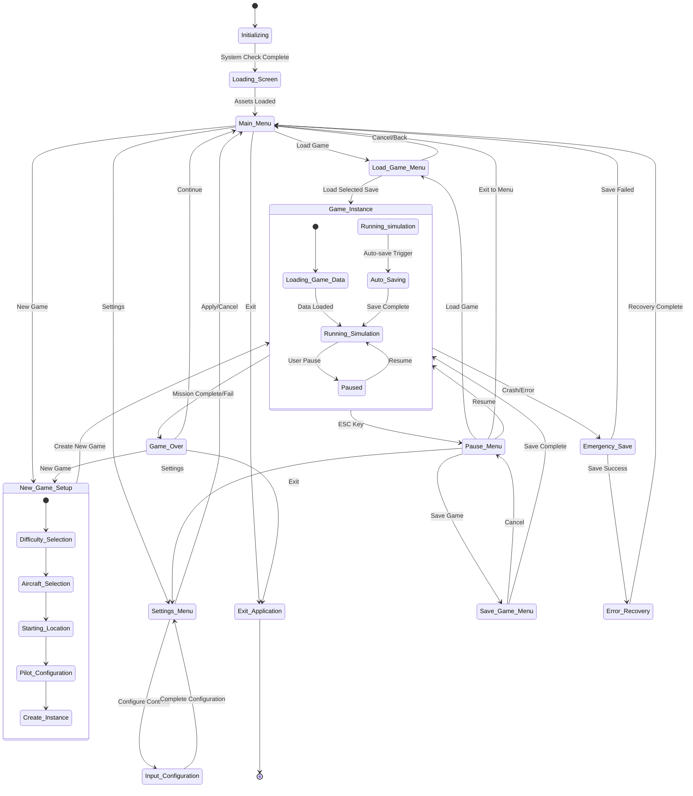
```mermaid
stateDiagram-v2
    [*] --> Initializing
    Initializing --> Loading_Screen : System Check Complete
    Loading_Screen --> Main_Menu : Assets Loaded
    
    Main_Menu --> New_Game_Setup : New Game
    Main_Menu --> Load_Game_Menu : Load Game
    Main_Menu --> Settings_Menu : Settings
    Main_Menu --> Exit_Application : Exit
    
    New_Game_Setup --> Game_Instance : Create New Game
    Load_Game_Menu --> Game_Instance : Load Selected Save
    Load_Game_Menu --> Main_Menu : Cancel/Back
    
    Settings_Menu --> Main_Menu : Apply/Cancel
    Settings_Menu --> Input_Configuration : Configure Controls
    Input_Configuration --> Settings_Menu : Complete Configuration
    
    Game_Instance --> Pause_Menu : ESC Key
    Game_Instance --> Game_Over : Mission Complete/Fail
    Game_Instance --> Emergency_Save : Crash/Error
    
    Pause_Menu --> Game_Instance : Resume
    Pause_Menu --> Save_Game_Menu : Save Game
    Pause_Menu --> Load_Game_Menu : Load Game
    Pause_Menu --> Settings_Menu : Settings
    Pause_Menu --> Main_Menu : Exit to Menu
    
    Save_Game_Menu --> Game_Instance : Save Complete
    Save_Game_Menu --> Pause_Menu : Cancel
    
    Game_Over --> Main_Menu : Continue
    Game_Over --> New_Game_Setup : New Game
    Game_Over --> Exit_Application : Exit
    
    Emergency_Save --> Error_Recovery : Save Success
    Emergency_Save --> Main_Menu : Save Failed
    Error_Recovery --> Main_Menu : Recovery Complete
    
    Exit_Application --> [*]
    
    state Game_Instance {
        [*] --> Loading_Game_Data
        Loading_Game_Data --> Running_Simulation : Data Loaded
        Running_Simulation --> Paused : User Pause
        Running_simulation --> Auto_Saving : Auto-save Trigger
        Paused --> Running_Simulation : Resume
        Auto_Saving --> Running_Simulation : Save Complete
    }
    
    state New_Game_Setup {
        [*] --> Difficulty_Selection
        Difficulty_Selection --> Aircraft_Selection
        Aircraft_Selection --> Starting_Location
        Starting_Location --> Pilot_Configuration
        Pilot_Configuration --> Create_Instance
    }
```

### Game Instance Management

**Instance Lifecycle:**
```python
class GameInstance:
    def __init__(self):
        self.game_state = None
        self.instance_id = str(uuid4())
        self.created_time = datetime.utcnow()
        self.last_saved = None
        self.auto_save_enabled = True
        self.auto_save_interval = 300  # 5 minutes
```

**Instance States:**
- **Uninitialized:** Instance created but no game data loaded
- **Loading:** Game data being loaded from save file or created new
- **Running:** Active simulation with all systems operational
- **Paused:** Simulation paused, UI responsive, systems frozen
- **Saving:** Data being written to persistent storage
- **Error:** Exception occurred, attempting recovery
- **Destroyed:** Instance cleaned up, memory released

### File System Management

**Cross-Platform User Data Locations:**

| Platform | Location | Example Path |
|----------|----------|--------------|
| **Windows** | `%APPDATA%/AirshipZero/` | `C:/Users/Username/AppData/Roaming/AirshipZero/` |
| **macOS** | `~/Library/Application Support/AirshipZero/` | `/Users/Username/Library/Application Support/AirshipZero/` |
| **Linux** | `~/.local/share/AirshipZero/` | `/home/username/.local/share/AirshipZero/` |

**Directory Structure:**
```
AirshipZero/
├── saves/
│   ├── {uuid4}.save          # Game save files
│   ├── {uuid4}.backup        # Automatic backups
│   └── metadata.json         # Save file index
├── settings/
│   ├── game_settings.json    # Game configuration
│   ├── input_config.json     # Control mappings
│   └── display_config.json   # Graphics settings
├── assets/
│   ├── books/               # User-created books
│   ├── screenshots/         # Photo gallery exports
│   └── custom_liveries/    # Aircraft customizations
├── logs/
│   ├── game.log            # Application logs
│   ├── error.log           # Error tracking
│   └── performance.log     # Performance metrics
└── cache/
    ├── terrain_data/       # Cached map data
    ├── weather_cache/      # Weather information
    └── temp/              # Temporary files
```

**Save File Naming Convention:**
```
Format: {uuid4}.save
Example: "a1b2c3d4-e5f6-4789-9abc-def012345678.save"

Metadata Entry:
{
  "id": "a1b2c3d4-e5f6-4789-9abc-def012345678",
  "name": "Cross-Country Adventure",
  "created": "2025-07-27T10:30:00Z",
  "lastPlayed": "2025-07-27T14:45:32Z",
  "playtime": 7248,
  "difficulty": "realistic",
  "currentMission": "photo_survey_mountains",
  "aircraft": "N07C",
  "location": "Hudson Valley",
  "thumbnail": "base64_encoded_screenshot"
}
```

### Menu System Architecture

**Main Menu Components:**
- **New Game:** Campaign setup and configuration
- **Continue:** Resume most recent save
- **Load Game:** Browse all available saves with thumbnails
- **Settings:** Graphics, audio, input, gameplay options
- **Credits:** Development team and acknowledgments
- **Exit:** Clean shutdown with optional save prompt

**In-Game Menu (ESC):**
- **Resume:** Return to simulation
- **Save Game:** Quick save or save as new file
- **Load Game:** Load different save file
- **Settings:** Adjust options without losing game state
- **Exit to Menu:** Return to main menu with save prompt

**Settings Categories:**
```json
{
  "graphics": {
    "resolution": "1920x1080",
    "fullscreen": true,
    "vsync": true,
    "antialiasing": "4x",
    "textureQuality": "high",
    "shadowQuality": "medium",
    "particleEffects": true
  },
  "audio": {
    "masterVolume": 0.8,
    "musicVolume": 0.6,
    "effectsVolume": 0.9,
    "voiceVolume": 0.7,
    "radioChatter": true,
    "engineSounds": true
  },
  "gameplay": {
    "difficulty": "realistic",
    "autoSave": true,
    "autoSaveInterval": 300,
    "pauseOnFocusLoss": true,
    "tooltips": true,
    "weatherEffects": true,
    "systemFailures": true
  }
}
```

### Save/Load System Implementation

**Save Process:**
1. **Validation:** Verify game state integrity
2. **Serialization:** Convert game state to JSON
3. **Compression:** Reduce file size with gzip
4. **Atomic Write:** Write to temporary file, then rename
5. **Backup Creation:** Keep previous version as backup
6. **Metadata Update:** Update save file index

**Load Process:**
1. **File Validation:** Check file existence and integrity
2. **Decompression:** Extract JSON from compressed file
3. **Schema Validation:** Verify data structure compliance
4. **Version Migration:** Update old save formats if needed
5. **State Recreation:** Rebuild game objects from data
6. **System Initialization:** Start all game systems

**Error Handling:**
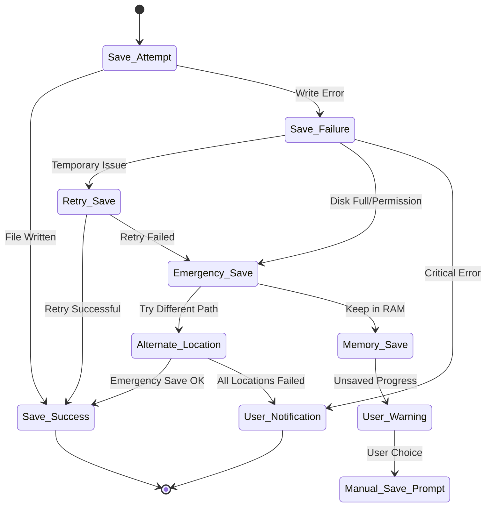
```mermaid
stateDiagram-v2
    [*] --> Save_Attempt
    Save_Attempt --> Save_Success : File Written
    Save_Attempt --> Save_Failure : Write Error
    
    Save_Failure --> Retry_Save : Temporary Issue
    Save_Failure --> Emergency_Save : Disk Full/Permission
    Save_Failure --> User_Notification : Critical Error
    
    Retry_Save --> Save_Success : Retry Successful
    Retry_Save --> Emergency_Save : Retry Failed
    
    Emergency_Save --> Alternate_Location : Try Different Path
    Emergency_Save --> Memory_Save : Keep in RAM
    
    Alternate_Location --> Save_Success : Emergency Save OK
    Alternate_Location --> User_Notification : All Locations Failed
    
    Memory_Save --> User_Warning : Unsaved Progress
    User_Warning --> Manual_Save_Prompt : User Choice
    
    Save_Success --> [*]
    User_Notification --> [*]
```

### Memory Management

**Game Instance Memory:**
- **Automatic cleanup** when switching between saves
- **Garbage collection** triggers before loading new games
- **Memory monitoring** with warnings for low memory
- **Asset streaming** for large terrain and texture data

**Resource Management:**
- **Lazy loading** of non-critical assets
- **Asset pooling** for frequently used objects
- **Texture compression** for memory efficiency
- **Audio streaming** for music and long sound effects

**Performance Optimization:**
- **Frame rate limiting** to prevent excessive CPU usage
- **Background processing** for non-critical calculations
- **LOD systems** for distant objects and terrain
- **Culling systems** to skip rendering invisible objects

This game process lifecycle system ensures robust application management with proper data persistence, cross-platform compatibility, and graceful error handling while maintaining the complex game state through all application phases.

---

## Development Guidelines & Architecture

### Core Development Philosophy

**Simplicity Over Cleverness:**
This ambitious feature set can only succeed with ruthlessly simple, understandable code architecture. The complexity lies in the game mechanics, not the code structure.

**Cognitive Load Management:**
- **Single Responsibility:** Each file handles one clear concept
- **Minimal Abstractions:** Avoid inheritance hierarchies and adapter patterns
- **Direct Relationships:** Components interact through clear, documented interfaces
- **Self-Documenting Code:** Variable and function names explain their purpose

### File Structure & Organization

**Project Structure:**
```
airshipzero/
├── pyproject.toml              # UV/pip dependency management
├── README.md                   # Quick start and uv run instructions
├── main.py                     # Application entry point
├── 
├── core/
│   ├── __init__.py
│   ├── game_state.py           # Central JSON data model
│   ├── constants.py            # Game constants and enums
│   ├── math_utils.py           # Aviation calculations
│   └── file_manager.py         # Save/load operations
│
├── systems/
│   ├── __init__.py
│   ├── navigation.py           # GPS, autopilot, waypoints
│   ├── engine.py               # Engine simulation and timing
│   ├── electrical.py           # Battery, bus, pump management
│   ├── fuel.py                 # Fuel balance and transfer
│   ├── communications.py       # Radio and ATC simulation
│   ├── camera.py               # Photography system
│   ├── cargo.py                # Weight, balance, inventory
│   ├── crew.py                 # Pilot, fatigue, skills
│   ├── books.py                # Library and book management
│   ├── weather.py              # Environmental simulation
│   └── missions.py             # Mission logic and progression
│
├── ui/
│   ├── __init__.py
│   ├── main_menu.py            # Main menu interface
│   ├── game_ui.py              # In-game HUD and panels
│   ├── input_handler.py        # Input mapping and processing
│   ├── dialogs.py              # Settings, save/load dialogs
│   └── widgets/
│       ├── __init__.py
│       ├── gauges.py           # Instrument displays
│       ├── panels.py           # System control panels
│       ├── inventory.py        # Inventory management UI
│       └── book_reader.py      # Book reading interface
│
├── assets/
│   ├── fonts/
│   │   └── RobotoMono-Regular.ttf
│   ├── images/
│   │   ├── instruments/        # Gauge faces, indicators
│   │   ├── aircraft/           # Aircraft exterior/interior
│   │   └── ui/                 # Menu backgrounds, icons
│   ├── sounds/
│   │   ├── engine/             # Engine sound samples
│   │   ├── radio/              # Radio chatter and effects
│   │   └── ambient/            # Environmental sounds
│   └── books/
│       ├── airship_history.md  # Pre-loaded book content
│       ├── emergency_manual.md # Reference materials
│       └── blank_journal.md    # Template for new books
│
├── tests/
│   ├── __init__.py
│   ├── test_navigation.py      # Navigation system tests
│   ├── test_engine.py          # Engine simulation tests
│   ├── test_fuel.py            # Fuel system tests
│   └── test_integration.py     # Full system integration tests
│
└── docs/
    ├── data-model.md           # This document
    ├── api-reference.md        # Code documentation
    └── development-guide.md    # Setup and contribution guide
```

### UV Integration & Distribution

**Simple Installation & Running (with your own fork):**
```bash
# Fork the repository on GitHub to your own account first
# Then install and run directly from your fork
uv tool run --from git+https://github.com/YOUR_USERNAME/airshipzero airshipzero

# Or clone your fork and run locally
git clone https://github.com/<your-github-username>/airshipzero
cd airshipzero
uv run airshipzero
```

**pyproject.toml Configuration:**
```toml
[project]
name = "airshipzero"
version = "0.1.0"
description = "Realistic airship flight simulator with complex systems"
authors = [{name = "Airship Zero Team"}]
requires-python = ">=3.10"
dependencies = [
    "pygame>=2.5.0",
    "numpy>=1.24.0",
    "Pillow>=10.0.0",
    "markdown>=3.5.0",
]

[project.optional-dependencies]
dev = [
    "pytest>=7.0.0",
    "black>=23.0.0",
    "ruff>=0.1.0",
]

[project.scripts]
airshipzero = "main:main"

[build-system]
requires = ["hatchling"]
build-backend = "hatchling.build"

[tool.uv]
dev-dependencies = [
    "pytest>=7.0.0",
    "black>=23.0.0", 
    "ruff>=0.1.0",
]
```

### Code Architecture Principles

**1. Data-Driven Design:**
```python
# BAD: Complex inheritance hierarchy
class BaseSystem(ABC):
    @abstractmethod
    def update(self): pass

class NavigationSystem(BaseSystem):
    def update(self): ...

# GOOD: Simple data manipulation
def update_navigation(game_state: dict) -> dict:
    """Update navigation data and return modified state."""
    nav_data = game_state['navigation']
    # Direct, clear operations on data
    return game_state
```

**2. Function-Based Systems:**
```python
# Each system is a module with clear functions
# systems/navigation.py
def calculate_ground_speed(true_airspeed: float, wind_data: dict) -> float:
    """Calculate ground speed from airspeed and wind."""
    # Simple, testable calculation
    
def update_autopilot(nav_data: dict, dt: float) -> dict:
    """Update autopilot state for one frame."""
    # Clear input/output, no hidden state
    
def navigate_to_waypoint(position: dict, waypoint: dict) -> dict:
    """Calculate navigation data for waypoint."""
    # Pure function, easy to test
```

**3. Clear Data Flow:**
```python
# main.py - Application entry point
def main():
    game_state = load_game_state()
    
    while running:
        # Simple, linear data flow
        game_state = handle_input(game_state, events)
        game_state = update_systems(game_state, dt)
        render_frame(game_state, screen)
        
def update_systems(game_state: dict, dt: float) -> dict:
    """Update all game systems in dependency order."""
    game_state = navigation.update(game_state, dt)
    game_state = engine.update(game_state, dt)
    game_state = fuel.update(game_state, dt)
    game_state = electrical.update(game_state, dt)
    # Clear execution order, no hidden dependencies
    return game_state
```

### System Interaction Guidelines

**Minimal Coupling:**
```python
# BAD: Systems directly reference each other
class FuelSystem:
    def __init__(self, electrical_system):
        self.electrical = electrical_system  # Creates dependency
        
# GOOD: Systems interact through shared data
def update_fuel_pumps(game_state: dict) -> dict:
    fuel_data = game_state['engine']['fuel']
    electrical_data = game_state['engine']['electrical']
    # Read what you need, modify only your data
    return game_state
```

**Data Ownership:**
```python
# Each system owns specific parts of game_state
# systems/engine.py owns game_state['engine']
# systems/navigation.py owns game_state['navigation']
# systems/cargo.py owns game_state['cargo']

# Cross-system data access is read-only
def calculate_weight_balance(game_state: dict) -> dict:
    cargo_weight = game_state['cargo']['totalWeight']  # READ
    fuel_weight = game_state['engine']['fuel']['currentLevel'] * 6.8  # READ
    # Only modify game_state['cargo']['centerOfGravity']  # WRITE
```

### Testing Strategy

**Unit Testing:**
```python
# test_fuel.py
def test_fuel_balance_calculation():
    # Arrange
    game_state = create_test_game_state()
    game_state['engine']['fuel']['tanks'][0]['currentLevel'] = 100.0
    
    # Act
    result = fuel.calculate_balance(game_state)
    
    # Assert
    assert result['engine']['fuel']['balance']['centerOfBalance'] == 156.8
```

**Integration Testing:**
```python
# test_integration.py
def test_fuel_pump_electrical_integration():
    # Test that fuel pumps affect electrical load
    game_state = create_test_game_state()
    
    # Turn on fuel pump
    game_state = fuel.activate_pump(game_state, 'forward_to_center')
    
    # Verify electrical load increased
    electrical_load = game_state['engine']['electrical']['batteryBus1']['load']
    assert electrical_load > 10.0  # Pump draws 2.5A
```

### Development Workflow

**Feature Development Process:**
1. **Design in data-model.md first** - Update this document
2. **Create failing test** - Define expected behavior
3. **Implement minimal code** - Just enough to pass test
4. **Update game state** - Ensure JSON structure matches
5. **Manual testing** - Verify in actual game
6. **Documentation** - Update relevant docs

**Code Review Checklist:**
- [ ] Function has single, clear responsibility
- [ ] No more than 3 levels of nesting
- [ ] Variables names explain their purpose
- [ ] No hidden dependencies on other systems
- [ ] Changes to game_state are localized
- [ ] Function can be tested in isolation
- [ ] Error cases are handled gracefully

### Performance Guidelines

**Optimization Priorities:**
1. **Correctness first** - Make it work
2. **Readability second** - Make it understandable  
3. **Performance third** - Make it fast (only when needed)

**Efficient Data Access:**
```python
# GOOD: Cache frequently accessed data
def update_engine_timing(game_state: dict, dt: float) -> dict:
    timing_data = game_state['engine']['timing']  # Single lookup
    
    # Work with local reference
    current_timing = timing_data['ignitionTiming']
    optimal_timing = timing_data['optimalTiming']
    
    # Update through local reference
    timing_data['effects']['powerOutput'] = calculate_power_effect(
        current_timing, optimal_timing
    )
    
    return game_state
```

### Error Handling Philosophy

**Graceful Degradation:**
```python
def update_navigation_system(game_state: dict, dt: float) -> dict:
    try:
        return _update_navigation_full(game_state, dt)
    except GPSError:
        # Continue with dead reckoning
        return _update_navigation_backup(game_state, dt)
    except Exception as e:
        # Log error but don't crash the game
        logger.error(f"Navigation system error: {e}")
        return game_state  # Return unchanged state
```

**User-Friendly Error Messages:**
```python
def load_game_save(file_path: str) -> dict:
    try:
        return _load_json_save(file_path)
    except FileNotFoundError:
        raise GameError("Save file not found. It may have been moved or deleted.")
    except JSONDecodeError:
        raise GameError("Save file is corrupted. Try loading a backup save.")
    except VersionError:
        raise GameError("Save file is from an older version. Migration required.")
```

This architecture prioritizes developer/AI cognitive capacity by keeping each component simple, focused, and independently testable. The complexity emerges from the interaction of simple systems rather than from complicated individual components.

---

## Game State Management

The centralized game state enables seamless save/load functionality and ensures data consistency across all systems.

### Save System Architecture

**Auto-Save Features:**
- Periodic automatic saves (configurable interval)
- Event-triggered saves (mission completion, landing)
- Emergency saves (system failure, crash protection)
- Multiple save slots with metadata

**Data Validation:**
- JSON schema validation on load
- Sanity checks for critical values
- Error recovery for corrupted saves
- Version migration for game updates

### Synchronization System

All game systems read from and write to the central data model:

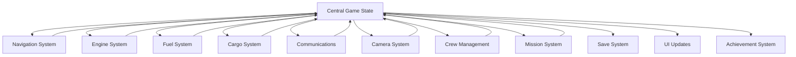
```mermaid
graph TD
    A[Central Game State] --> B[Navigation System]
    A --> C[Engine System]
    A --> D[Fuel System]
    A --> E[Cargo System]
    A --> F[Communications]
    A --> G[Camera System]
    A --> H[Crew Management]
    A --> I[Mission System]
    
    B --> A
    C --> A
    D --> A
    E --> A
    F --> A
    G --> A
    H --> A
    I --> A
    
    A --> J[Save System]
    A --> K[UI Updates]
    A --> L[Achievement System]
```

This architecture ensures that all systems remain synchronized and that the complete game state can be serialized to JSON for saving, loading, or network synchronization.

---

## Implementation Notes

1. **Real-time Updates:** All systems update at 60 FPS with interpolation for smooth animations
2. **Performance Optimization:** Heavy calculations cached and updated only when necessary
3. **Modular Design:** Each system can be independently developed and tested
4. **Data Validation:** All inputs validated to prevent invalid game states
5. **Error Handling:** Graceful degradation when systems encounter errors
6. **Extensibility:** New systems can be added without modifying existing code

This data model serves as the complete specification for all game mechanics and will guide the implementation of each system in the Airship Zero simulator.
